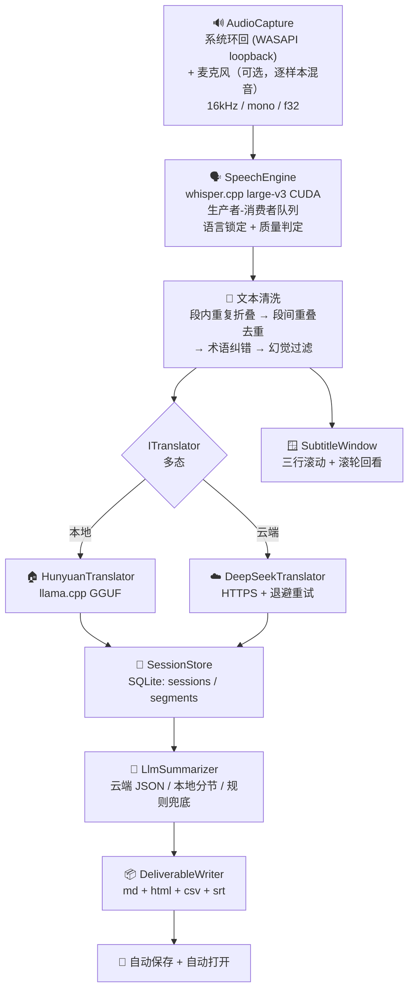

# AudioTranslator · 功能目标 / 架构 / 规划

> **这是本项目的开发基准文档。**
> 动手改代码之前先看第一章；改完如果和本文不一致，回来把本文改一致。
> 最后更新：2026-09-14

---

## 0. 这份文档怎么用

| 文档 | 地位 |
|---|---|
| **`STATE.md`** | **先读这份。** 滚动状态：现在到哪了、下一个动作、工作方式、代码风格、最近踩坑。**每次收工更新** |
| **本文（`PROJECT.md`）** | **稳定基准**。目标、架构、设计决定、长期记忆设计、规划、开发流程的最终口径。查询用，不常变 |
| `EchoMind_项目优化建议与下一阶段路线.md` | **外部建议稿**（GPT 产出）。是输入，不是结论；采不采纳以本文为准 |
| `competition/作品方案-大纲.md` | 比赛材料（文档 / PPT / 演示视频）的内容大纲 |
| `README.md` | **已过时**，描述的是早期版本（还说"按提示选择后端"）。以本文为准，不要拿它当依据 |
| `competition/问卷-使用说明.md` | 市场调研问卷的操作说明，与开发无关 |

**四条使用规则**

1. 加任何功能前，先在第一章确认它服务哪一条目标。**服务不了的就先不做**——本项目最大的风险不是功能少，是方向散。
2. 每个模块的设计决定都在 §3.5 里有"为什么"。改之前先读那一条，很多坑已经踩过了。
3. **碰"知识 / 术语 / 长期记忆"之前，先读第六章。** 那里的 §6.5 有一条红线（模型猜的东西不能自动变成约束），破了会静默污染整条链路。
4. **动手前先读第八章**（开发流程）——尤其 §8.0。修好的 bug 要把"出问题怎么判断"写进代码注释（§8.7）。
5. **每次收工更新 `STATE.md`** —— 那份是滚动状态，不更新就等于下次从零开始。

**先读哪一章**

| 你要做的事 | 先读 |
|---|---|
| **接着上次继续干** | **`STATE.md`**（进度 / 下一个动作 / 工作方式 / 代码风格） |
| 第一次接触这个项目 | 一 → 二 → 三 |
| 想知道现在能不能跑、怎么验证 | 四 |
| 改任何代码 | 三 §3.5 + **八** |
| 碰知识 / 术语 / 记忆 | **六** |
| 决定接下来做什么 | 一 §1.6 + 七 |
| 想移植到别的平台 | **三 §3.6**（结论：不做桌面版；要 Linux 就做无界面批处理版） |

---

## 一、要做什么（功能目标）

### 1.1 一句话

> **打开就听，结束就给总结；用得越久，越懂你。**

### 1.2 用户只做三个动作

```
打开  →  正常做自己的事  →  结束
```

中间**不要求**用户做任何选择和配置。

### 1.3 产品红线（违反即做错）

| 红线 | 原因 |
|---|---|
| **不做模式选择** | 不允许弹"1 会议 / 2 课程 / 3 视频 / 4 对话"。场景必须自动判断 |
| **不要求手动配置** | 模型路径自动探测，后端自动降级，参数都有合理默认值 |
| **API key 必须可选** | **没有 key 也要能完整跑通**（本地混元翻译 + 规则摘要 + 本地知识库）。key 只影响一件事：摘要质量。把 key 设为必需，等于要求用户先去注册充值——"点开就用"当场就没了 |
| **结束必须是一个动作** | 全局热键 `Ctrl+Alt+Q`，任何程序有焦点时都能按。用户在看全屏视频，控制台没焦点 |
| **必须能离线跑** | 拔网线也要能识别、翻译、出纪要（本地 Whisper + 本地混元 + 规则摘要） |
| **提问是稀缺资源** | 结束时最多问 5 个、回车即跳过、只问影响后续识别/翻译的内容。问十条不如问对两条——按字面"有陌生知识就问"会让用户在第三次使用时就不看了 |

### 1.4 覆盖场景：一套管线，只换输出

会议 / 课程 / 视频 / 对话共用同一条管线，**只有交付物的标题和章节名随场景变**：

| 场景 | 文档标题 | 章节 |
|---|---|---|
| 会议 | 会议纪要 | 议题要点 / 行动项 |
| 课程 | 课堂笔记 | 本讲内容 / 知识点 / 作业与任务 |
| 视频 | 内容笔记 | 主要内容 / 关键信息 |
| 对话 | 对话记录 | 谈到的内容 / 待办 |

> 架构上**不要**裂成四套 Pipeline。场景只改变：输出结构、摘要重点、行动项规则、交付模板。
> 这一点在 §3.5 有专门的"为什么"。

### 1.5 交付物就是成绩

赛道硬指标要求"**结果交付：能交付可被直接验收、使用的成果**"。
每次会话结束自动生成到 `<out>/session-<id>/`：

| 文件 | 对应 |
|---|---|
| `meeting-<id>.md` | 报告 |
| `meeting-<id>.html` | 网页（单文件，结束自动打开） |
| `actions.csv` | 表格 |
| `transcript.srt` | 双语字幕（加分项） |

### 1.6 明确**不做**（当前阶段）

| 不做 | 原因 |
|---|---|
| **Linux / macOS 桌面版** | 主要用户是 Windows 桌面用户；而且两个核心卖点（**系统音频采集**、**置顶字幕窗**）在 Linux 上要么重写、要么做不到（详见 §3.6）。**移植会先丢掉卖点，再换来一个能跑的壳** |
| 说话人分离（Diarization） | 赛道里不是硬指标；在线会议改用"双流分轨"绕开（见 §3.5⑨） |
| **跨会话逐句字幕浏览** | **数量级不成立**：一次会议几百句、一个月上万句，靠滚轮翻等于没有。跨会话要的是"问"和"跳"，不是"翻"（做法见 §6.9 / §6.8 Evidence） |
| 更强的长期记忆检索 | 属于 P2，会挤掉 P0 |
| 个人知识图谱、多轮 Agent Planning | 同上 |

> ⚠️ **两处别搞混：**
> 1. "自增长知识库"（第六章）是 **P0**，"个人知识图谱"是它的加强版，属 P2。
> 2. **不做 Linux 桌面版 ≠ 永远没有 Linux。** 真要 Linux，做的是**无界面批处理版**（喂文件、不出字幕），那个版本恰好**不需要**上面那两个平台专有部件，反而更简单。见 §3.6。

---

## 二、现在有什么（功能清单 + 验证状态）

**验证状态口径**：✅ 已实测通过 ｜ ⚠️ 代码就绪但未端到端实测 ｜ ❌ 已知不可用

### 2.1 采集与识别

| 功能 | 位置 | 状态 |
|---|---|---|
| 系统音频环回采集（WASAPI loopback） | `audio_capture.cpp` | ✅ |
| 麦克风采集（与环回逐样本混音） | `audio_capture.cpp` + `--mic` | ⚠️ 单路本身可用，双路端到端未实测 |
| Whisper large-v3 CUDA 识别（16kHz/mono/f32） | `SpeechEngine.cpp` | ✅ 391–854ms |
| 语言检测一次后锁定，每 120s 重检 | `SpeechEngine.cpp` | ✅ |
| VAD 分句（RMS + 滑动窗口兜底） | `main.cpp` | ✅ |
| 幻觉过滤（no_speech / 置信度 / 黑名单 / 提示回显 / 跨段重复） | `SpeechEngine.cpp` | ✅ 可测的两项已进自检：提示回显 3/3 + 跨段重复 5/5 |
| 段间重叠去重（可跳过 0–2 个功能词） | `main.cpp` `strip_overlap` | ✅ 自检 6/6 |
| 段内重复折叠 | `main.cpp` `collapse_repeats` | ✅ 自检 3/3 |

### 2.2 翻译

| 功能 | 位置 | 状态 |
|---|---|---|
| 本地混元 HY-MT1.5-1.8B（llama.cpp，Hunyuan 原生模板） | `HunyuanTranslator.cpp` | ✅ 77–320ms（均 ~124ms） |
| 云端 DeepSeek **翻译**（HTTPS + 指数退避） | `DeepSeekTranslator.cpp` | ⚠️ 握手已通（曾因 CA 失败，已修），但**翻译路径仍无 key 未端到端实测**。注意：云端**摘要**路径已验证（见 §2.4） |
| 双后端多态 + 运行时切换 | `ITranslator.h` | ✅ |
| 术语纠错（与已知专名编辑距离 = 1 且长度差 ≤ 1 则替换，保留标点） | `TermFixer.cpp` | ✅ 自检 7/7 |
| **术语约束译文**（专名在译文里保持同一写法） | `ITranslator.cpp` + 两个后端 | ✅ **已实测**：A/B 完整复现并修好会话 #11 的 `Erica / 埃里卡` 不一致 |
| 源语言 == 目标语言时跳过翻译 | `main.cpp` | ✅ |

### 2.3 呈现

| 功能 | 位置 | 状态 |
|---|---|---|
| 半透明置顶悬浮字幕窗（三行滚动） | `SubtitleWindow.cpp` | ✅ 用户目视确认 |
| 全程可拖动、可拉伸、不抢焦点、不进任务栏 | `SubtitleWindow.cpp` | ✅ |
| 全局热键结束（`Ctrl+Alt+Q`） | `SubtitleWindow.cpp` | ✅ |
| 鼠标滚轮回看本会话历史（上限 500 条） | `SubtitleWindow.cpp` | ✅ 6/6 断言通过 |

### 2.4 沉淀与交付

| 功能 | 位置 | 状态 |
|---|---|---|
| SQLite 落库（sessions + segments，毫秒时间戳） | `SessionStore.cpp` | ✅ |
| 规则摘要兜底（完全离线） | `DeliverableWriter.cpp` | ✅ |
| 场景判定（`content_type`） | `LlmSummarizer.cpp` / `DeliverableWriter.cpp` | ⚠️ 大模型版直接给（**已实测判对**：英语教学节目 → 课堂笔记）；规则版只靠关键词粗判（`课`/`lesson`/`lecture` → 课程，`会议`/`meeting` → 会议），判不出按"会议"处理，**视频/对话两类规则版判不出来** |
| **云端大模型摘要**（DeepSeek） | `LlmSummarizer.cpp` | ✅ **2026-09-14 会话 #11 端到端验证通过**（`摘要来源：大模型生成 · 云端 DeepSeek`） |
| 本地大模型摘要 | `LlmSummarizer.cpp` | ⚠️ **必须用 instruct 模型**；混元 1.8B 是翻译模型，会复读原文 |
| 失败自动降级到规则摘要 | `LlmSummarizer.cpp` | ✅ |
| 行动项回填段落号（LCS，≥6 字节） | `LlmSummarizer.cpp` | ✅ 回填正确；但**内容本身会抽错**，见 §5 |
| 四种交付物自动生成 + 自动打开网页 | `DeliverableWriter.cpp` | ✅ |
| CA 证书探测（HTTPS 必需） | `CaBundle.cpp` | ✅ 内置 150 张证书 |
| 自检 24 例（不需要模型） | `main.cpp --selftest` | ✅ 24/24 |

### 2.5 实测性能（RTX 4060 Laptop / 8187 MiB）

| 环节 | 耗时 |
|---|---|
| **启动预热（Whisper 加载）** | **6.9–8.4 s**（这期间听不到任何东西） |
| Whisper 识别 | 391–854 ms |
| 本地翻译 | 77–320 ms（均 ~124 ms） |
| 端到端（说完到出中文字幕） | ~0.8 s |
| 识别置信度 | 0.75–0.90 |

显存：Whisper ~3.1 GB + 混元 ~0.7 GB + （可选）Qwen instruct ~1.0 GB ≈ 4.8 GB / 7 GB 可用。

> ⚠️ **启动预热这段时间"打开就听"是不成立的**——用户打开程序后前 7 秒左右什么都听不到。
> 程序会把这行打出来（`[System] Whisper 加载完成，耗时 N ms`），
> 既是给用户的解释，也是以后做优化的基线（例如改小模型、或把加载挪到后台线程）。

**真实会话记录**（用于回归对比，每次跑完真实会话后回来补一行）

| 会话 | 内容 | 时长 | 条数 | 平均延迟 | 摘要 |
|---|---|---|---|---|---|
| #10 | 英语教学节目 | 1 分 32 秒 | 36 | 85 ms | 云端 DeepSeek |
| #11 | EnglishPod 教学（旅行主题） | 1 分 3 秒 | 25 | 96 ms | 云端 DeepSeek |

> `#11` 这一场是**首次端到端验证云端摘要路径**，同时暴露了三个真问题（见 §5）。

---

## 三、架构

### 3.1 数据流



### 3.2 模块职责

| 模块 | 头文件 / 实现 | 职责 | 不该做的事 |
|---|---|---|---|
| `AudioCapture` | `inc/audio_capture.h` | 采音频，输出 float 缓冲 | 不做 VAD |
| `SpeechEngine` | `inc/SpeechEngine.h` | 音频→文字，质量判定，语言锁定 | 不做翻译 |
| `ITranslator` | `inc/ITranslator.h` | 翻译抽象；记录"最新译文的来源" | 不碰 UI |
| `HunyuanTranslator` / `DeepSeekTranslator` | 同名 `.cpp` | 两种后端实现 | 不做降级决策（由 `main.cpp` 决定） |
| `TermFixer` | `inc/TermFixer.h` | 码点级编辑距离纠错 | 不改非专名 |
| `SessionStore` | `inc/SessionStore.h` | 单例，落库与查询 | 不做渲染 |
| `LlmSummarizer` | `inc/LlmSummarizer.h` | 摘要与行动项抽取 | 不写文件 |
| `DeliverableWriter` | `inc/DeliverableWriter.h` | 纯函数渲染四种交付物 | 不访问数据库（只吃传入数据，便于单测） |
| `SubtitleWindow` | `inc/SubtitleWindow.h` | 悬浮窗 + 全局热键 + 滚轮回看 | 不做业务判断 |
| `AppConfig` | `inc/AppConfig.h` | 参数解析 + 路径探测 | — |
| `main.cpp` | — | 编排：VAD、清洗、配对、降级、交付 | 不藏业务逻辑到别处 |

### 3.3 线程模型

| 线程 | 做什么 | 与谁通信 |
|---|---|---|
| 主线程 | VAD 分句、文本清洗、翻译配对、UI 推送、落库、结束生成纪要 | 轮询 `SpeechEngine` / `ITranslator` 的计数器 |
| miniaudio 回调 | 采集音频写入环形缓冲 | 无锁/短锁 |
| `SpeechEngine` 工作线程 | 取音频 → Whisper → 写结果 + 计数器 | 条件变量 |
| `ITranslator` 工作线程 | 取文本 → 翻译 → 写结果 + 计数器 | 条件变量 |
| `SubtitleWindow` 线程 | 建窗、消息循环、低级鼠标钩子、绘制 | `PostMessage(WM_AT_REPAINT)` |

**约定**：识别与翻译**都是异步计数器**，主线程靠 `get_inference_count()` / `get_translation_count()` 判断"有没有新东西"，**不要比较文本**（两段文字相同时会漏判）。

### 3.4 数据模型

```sql
sessions(id, started_at, ended_at, engine, note)
segments(id, session_id, seq, ts, src_text, tgt_text, engine, ms, confidence)
CREATE INDEX idx_segments_session ON segments(session_id, seq);
```

- 时间戳**毫秒精度**（`YYYY-MM-DD HH:MM:SS.mmm`）
- `confidence` 是识别置信度，一路带到库里
- ⚠️ ~~**FTS5 源码在 `external/sqlite3` 里，但 `SQLITE_ENABLE_FTS5` 没有定义**~~
  → **已解决（2.1）**：`SQLITE_ENABLE_FTS5` + `SQLITE_ENABLE_COLUMN_METADATA` 已在 `CMakeLists.txt` 打开。
  ⚠️ 改这两个宏**必须重新 configure**（`cmake -S . -B build`），只 build 不会生效。
- ⚠️ **`knowledge_fts` 是外部内容表（`content='knowledge'`），必须靠触发器维护，不能手写 DML**。
  它的 `count(*)` 读的是内容表 —— 所以索引空着也可能"看起来有行"，是最阴的一类假绿灯。
  正解：`knowledge` 上挂 `knowledge_ai` / `knowledge_ad` / `knowledge_au` 三个触发器，
  另外每次打开库 `INSERT INTO knowledge_fts(knowledge_fts) VALUES('rebuild')` 一次，
  自愈历史库。详见 §8.8 反模式⑩。

### 3.5 关键设计决定（**改代码前必读**）

#### ① 语言只检测一次然后锁定，每 120s 重检
逐块检测时置信度只有 p≈0.22，会来回跳，同一场会议的中文译文一会儿英文一会儿中文。
**判断**：语言是会话级属性，不是句子级属性。

#### ② 字幕必须三行、且"滚动"而不是"跳变"
```
① 上一句译文（14pt 暗）  ← 新句子出现时它留在原地
② 当前句原文（16pt 灰）
③ 当前句译文（22pt 亮）  ← 主体；没翻好时留空，不显示占位文字
```
**判断**：占位文字（"翻译中…"）随后被译文替换，本身就是一次多余闪烁 → 改由底部状态行承担。

#### ③ 句子**被下一句顶掉时**才进历史，不是自己翻完时
这是踩过的坑：译文一到就 `push_history`，历史里最新一条就是"当前这句"，而顶部行显示的正是"历史里最新一条" → **顶部行和正文变成同一句话，屏幕上看起来就是重复了一遍**。
**判断**：入历史的时机 = 被顶出正文的那一刻。译文迟到时先用 `pending_source` 记住原文，等译文到了再补。
**出问题怎么判断**：窗口标题带 `p=<顶部行字节数> c=<正文字节数>`，`p` 应当等于上一句译文长度。

#### ④ 识别与翻译按"来源"配对，不能拿"最新原文 + 最新译文"拼
两条异步流，翻译总滞后一句。直接拼会出现「英文第 N 句 + 中文第 N-1 句」。
`ITranslator::get_last_source()` 返回该译文的原文，**配对关系由后端保证**，比在 `main.cpp` 里自己记更可靠。
**出问题怎么判断**：译文来源与当前原文不符时必须丢弃，否则就是错配。

#### ⑤ 悬浮窗永远拿不到焦点，所以滚轮必须靠低级鼠标钩子
窗口是 `WS_EX_NOACTIVATE`（不能抢焦点，否则看视频时会打断你），而滚轮消息默认只发给**焦点窗口**。
Windows 10 有"悬停滚动"，但那是系统设置项，用户或播放器可能关掉 → 不能依赖。
**判断**：用 `WH_MOUSE_LL`，并且**只在真正做了事的时候才拦截**：实时模式往上滚（进历史）拦，往下滚（没东西可看）放行——否则鼠标停在字幕上就没法调音量。

#### ⑥ 历史位置用"序号"记，不用下标
用户往回看的时候新句子还在进来。用下标记位置，每来一句整个视图就往上漂一格，**越看越跳**。
**判断**：单调递增序号做锚点，前面被裁掉时再收敛。

#### ⑦ 行高必须由字号推算，不能手写像素再整体缩放
实测 Microsoft YaHei UI 在 144 DPI 下：字号像素 24→31px、30→39px、32→41px、48→62px，即 **行高 ≈ 字号像素 × 1.30**。
手写行高会踩坑：22px 的行放 15pt 字，在 150% 缩放下就是 39px 字高挤进 33px 行，上下各裁 3px，**笔画被削平**。
**判断**：`make_layout(dpi)` 统一算，`on_paint()` 和窗口高度用同一份参数。

#### ⑧ 窗口底部要收敛，不能只按屏幕高度百分比定位
`0.78 × 屏高 + 窗口高` 在小屏 + 高 DPI 上会溢出：768 高的屏在 125% 缩放下，`0.78×768 + 197 = 796 > 768`，状态行被推出屏幕。

#### ⑨ 平台差异绕开：在线会议用"双流分轨"，不用说话人分离
Diarization 成本高且不是赛道硬指标。
在线会议里"对方"走系统环回、"你"走麦克风，**物理上天然分轨**，各自锁定语言即可。
面对面交谈没有这个条件 → 只能用"识别置信度"作为语言状态的证据（whisper.cpp 不暴露语言概率）。

#### ⑩ 摘要必须用 instruct 模型
混元 `HY-MT1.5-1.8B` 是**翻译模型**，让它做摘要会**原样复读转录文本**。
本地摘要必须 `--llm-model` 指定一个 instruct 模型（如 Qwen）；否则回退规则摘要。

#### ⑪ HTTPS 必须显式指定 CA bundle
Windows 上 OpenSSL 不会自动用系统证书库，`SSL server verification failed` 是必然结果。
**判断**：`CaBundle::find_ca_bundle()` + `set_ca_cert_path()`，内置 150 张证书兜底。

#### ⑫ 服务的是"任何场景"，所以场景只影响输出层
不要为四个场景写四套管线。场景识别 → 只决定"文档标题和章节名"（`DeliverableWriter::labels_for`）。

#### ⑬ "助手" = 一套独立的知识与历史，不是一个标签
用户要"按场景选不同助手"。**实现上它等于一个独立的库文件 + 独立的输出目录 + 独立设置**，
而不是给每张表加一列 `profile_id`。

判断依据：现有 `--db <文件>` **已经**就是这种隔离，一行 schema 都不用改、不用迁移；
而加列方案要让每个查询、FTS 检索、唯一约束 `(kind,key)` 都带上 profile 维度，改动面大得多。

**边界（2026-09-17 定）**：知识 / 历史会话 / 纪要 / 任务 / 语言 / 是否上云 —— 跟着助手走；
**模型路径和 API key 是全局的**（3GB 模型不该复制多份，key 是账号级的）。

⚠️ **必须先修的一个前提**：交付物目录名是 `session-<id>`，而 id 是**每个库各自编号**的。
两个助手各有会话 #5 就会写进同一个目录，**后写的静默盖掉先写的**。
所以"输出目录按助手分"（§7 4.1）必须在加多助手之前做。

#### ⑭ 保持控制台子系统
GUI 阶段**不要**改成 `/SUBSYSTEM:WINDOWS`。整个验证阶梯
（`--selftest` / `--wav` / `--gaps` / `--extract` / `verify_memory.py`）都走控制台，
改了会把它们全废掉 —— 而那是这个项目唯一可靠的质量保障。
做法：启动时隐藏控制台窗口，日志改成写文件 + UI 里一个日志面板。

---

### 3.6 平台依赖边界（**本项目只做 Windows 桌面版**）

> 结论先写：**不做 Linux/macOS 桌面版**（§1.6）。这一节把边界记清楚，
> 免得以后有人以为"C++ 写的应该好移植"而低估它。

**各模块的平台依赖实测**

| 模块 | 平台依赖 | 能否直接移植 |
|---|---|---|
| `SpeechEngine`（whisper.cpp） | **零** | ✅ 直接可用 |
| `HunyuanTranslator` / `DeepSeekTranslator` | 零（llama.cpp + httplib/OpenSSL 本身跨平台） | ✅ 直接可用 |
| `SessionStore` / `DeliverableWriter` / `LlmSummarizer` / `TermFixer` | 零 | ✅ 直接可用 |
| `AppConfig` | 零（路径分隔符是小事） | ✅ |
| `CaBundle` | 环境变量 + 相对路径已跨平台；只有两条 Windows Git 路径 | ✅ 加一条 Linux 路径即可 |
| `main.cpp` | **4 处**：`<conio.h>`、`system("chcp 65001")`、`_kbhit()`、`_getch()` | ✅ 半天级（termios 替身） |
| `CMakeLists.txt` | vcpkg 工具链硬编码为 `C:/dev/vcpkg`；已有 `if(WIN32)` / `if(MSVC)` 分支 | ✅ 把那一行改条件即可 |
| **`audio_capture`** | `ma_device_type_loopback`（WASAPI 环回，**Windows 专有**） | ❌ **要换后端** |
| **`SubtitleWindow`** | 分层窗口 / `WS_EX_*` / `RegisterHotKey` / `WH_MOUSE_LL` / GDI，**整个文件就是平台代码** | ❌ **要重写** |

**两个真障碍（都不是代码量问题）**

**① 系统音频采集：miniaudio 在 Linux 上没有 loopback。**
Windows 上一行 `ma_device_type_loopback` 拿到扬声器输出；Linux 上必须走 PulseAudio 的 monitor source（`pactl list short sources` 里的 `.monitor`）或 PipeWire。而且"能不能听到 Zoom 里的对方"取决于音频路由——应用输出到哪个 sink 由桌面环境决定，不是程序能假定的。

**② 半透明置顶字幕窗：Wayland 下可能根本做不到。**
普通应用**不允许**把自己放到任意位置、置顶、且不抢焦点——这是协议层限制，不是代码问题（GNOME 不支持 `wlr-layer-shell`）。X11 下能做，但 X11 正在被淘汰。
**也就是说"边看画面边看字幕"这个体验，在 Linux/Wayland 上只能退化成全屏覆盖或终端字幕。**

**这两条恰好就是产品的核心卖点。** 移植会先丢掉卖点，再换来一个能跑的壳。

**但"要 Linux"的正确形态不是移植桌面版，而是无界面批处理版：**

```
输入音频文件/流 → 识别 → 翻译 → 落库 → 出纪要
```

| 桌面版需要 | 无界面版 |
|---|---|
| 采系统声音（要换 PulseAudio/PipeWire 后端） | ❌ 不需要，直接喂文件 |
| 置顶半透明字幕窗（Wayland 做不到） | ❌ 不需要，没有屏幕 |

而它需要的（whisper.cpp / llama.cpp / SQLite / OpenSSL）**本来就全是跨平台的**。
所以：**无界面批处理版在 Linux 上比桌面版更简单，因为它砍掉的正是那两个平台专有部件。**

**因此不需要为 Linux 做任何额外工作**，只要把 `--wav <file>` 这个**文件输入入口**做出来（见 §7 P1）：
它现在就让 L3 端到端测试可脚本化，将来也直接是无界面版的地基。

#### 历史决策：不合并 `da97d96`

远程 `main` 上有一笔早于本线的提交 `da97d96`（2026-06-09「适配 Linux 编译，新增 WAV 文件测试模式」），
与本文档描述的新线在 `7717ace` 分叉。**决定：不合并。**

| 它的内容 | 处置 |
|---|---|
| CMakeLists 去掉硬编码 vcpkg 路径 + `elseif(UNIX)` 链接 `dl` | 可取，十几行，等真需要时再拿 |
| `_kbhit/_getch` 的 termios 替身、`chcp` 加 `#ifdef _WIN32` | 可取，小且无害 |
| `inc/wav_reader.h`（WAV 读入 + 重采样到 16k）、菜单式 WAV 测试 | **摘出来**做成正经的 `--wav` 参数（§7 P1） |
| `ma_device_type_loopback` → `ma_device_type_capture`，**无 `#ifdef` 保护** | ❌ **不能要**：这会让 Windows 上从"采系统声音"退化成"采麦克风"，**把核心能力弄坏** |
| 模型路径 `../../../models/` → `../../models/` | ❌ 更硬的硬编码；`AppConfig` 已解决，合并是倒退 |

> 当前代码在这点上是对的（`audio_capture.cpp`）：按来源选 `ma_device_type_capture`（麦克风）
> 还是 `ma_device_type_loopback`（系统声音）。

---

## 四、怎么跑、怎么测

### 4.1 构建

```powershell
# ⚠️ 先杀掉残留进程，否则链接会报 LNK1168（exe 被占用）
Get-Process Translator -ErrorAction SilentlyContinue | Stop-Process -Force

cmd /c "call ""C:\Program Files\Microsoft Visual Studio\2022\Community\VC\Auxiliary\Build\vcvars64.bat"" >nul 2>&1 && set VCPKG_ROOT=C:\dev\vcpkg && cmake --build C:\dev\projects\AudioTranslator\build --config RelWithDebInfo --target Translator"
```

产物：`build\RelWithDebInfo\Translator.exe`
依赖目录约定：`../whisper.cpp`、`../llama.cpp`、`../models`

### 4.2 跑

```powershell
cd C:\dev\projects\AudioTranslator\build\RelWithDebInfo
.\Translator.exe                                # 直接开始记录（无任何交互）；Ctrl+Alt+Q 结束并出纪要
.\Translator.exe --mic                          # 叠加麦克风
.\Translator.exe --translator cloud --api-key sk-xxx   # 用云端 DeepSeek 翻译
.\Translator.exe --target en                    # 翻译成英文
.\Translator.exe --summarizer rules             # 强制离线规则摘要
.\Translator.exe --lang ja --target zh          # 固定源语言，跳过自动检测
.\Translator.exe --wav <file>                   # 回放音频文件走完整管线（测试入口）
```

**启动不再有任何交互**（1.2 已完成）：后端由 `--translator local|cloud` 决定，默认 `local`。

> **默认 local 而不是"有 key 就用云端"**：用户完全可能只让**摘要**上云，
> 而翻译必须留本机（"数据不出本机"是卖点）。所以云端翻译只能显式指定，
> 不能靠 `--api-key` 的存在来推断。

> **一次运行 = 一场会话，结束就退出。** 原来外层循环是为了"结束后换后端再开一场"，
> 选择题删掉之后回开头就变成"刚按完结束又立刻开始录"的坏行为。
> 代价是想连做两场要重新启动，**模型要重新加载**（实测 6.9–8.4 秒，见 §2.5）。

### 4.3 验证入口

| 命令 | 验什么 | 期望 |
|---|---|---|
| `--selftest --db t.db` | **纯逻辑**：清洗、去重、术语、行动项校验、WAV 解析、知识落库+FTS 往返、缺口检测 | 全部通过（不需要模型，秒级） |
| `--test-window` | 悬浮窗外观、滚动、滚轮回看、拉伸 | 6 句示例 + 40 秒停留 |
| **`--wav <file>`** | **整条管线端到端**（不打开音频设备、零交互） | 识别→翻译→落库→交付物，退出码 0 |
| **`--gaps --db t.db`** | 库里的待确认知识 → 该问用户什么（§6.7） | 按优先级列出问题，最多 5 个 |
| **`--extract <id>`** | 对一场**已存下来的**会话跑自动抽取。默认**只读**，加 `--apply` 才写库并接着问 | 列出抽出的候选；`--apply` 时全部落成 candidate |
| **`--ask` / `--no-ask`** | 会话结束的确认交互是否启用（不指定 = 看情况，见 §6.7） | `[确认] 跳过（<原因>）` 或真的问出来 |
| **`python tools\ab_translation_constraint.py`** | **§6.5 红线的行为级回归**：真句子 + 真模型 | ① 基线逐字复现历史失败 ② candidate 与基线**逐字相同** ③ confirmed 把译文纠正成 `Erica`/`Marco` |
| `--demo-session --db t.db` | 往库里写一次假的 12 条会话 | 打印 `已写入演示会话 #1`，**不生成文件** |
| `--export 1 --db t.db --out out_dir` | 由库里的会话重出交付物 | `out_dir\session-1\` 下 4 个文件 |
| `--dump-prompt` | 看发给大模型的 prompt | 打印模板 |
| `--list` | 模型路径探测 | 只打印配置，不启动 |
| **`python tools/verify_memory.py <db>`** | **长期记忆数据层**（知识库的地基） | 四张表都在 + **触发器真能维护索引**（写→查得到→删→查不到） |

**`verify_memory.py` 为什么用 Python 写**：它是**独立实现**的验证 —— Python 自带的 sqlite3 和项目里 vendored 的 `sqlite3.c` 是两套完全不同的构建。两套都能用 FTS5，才说明"能建表"不是靠某个侥幸的编译选项。默认全程在一个事务里、最后回滚，**不改动原库**（`--seed-demo` / `--clear` 例外，它们需要显式指定且只碰 `__demo_` 前缀的行）。

> ⚠️ **它验的是"触发器"不是"表存在"。** 早先这一项只查四张表在不在，
> 于是"`knowledge_fts` 的索引其实一条都没建起来、MATCH 啥也查不到"这个 bug
> 藏了两轮。现在它**一句 FTS 语句都不写**：只往 `knowledge` 插，
> 索引必须由触发器自己跟上，然后查回来、再删掉确认删也同步。
> 教训记在 §8.8 反模式⑩：**拿"东西在不在"当验收，等于没验收。**

> ⚠️ **必须用「程序真正在用的那个库」。** `--db t.db` 是**相对当前目录**的，而
> `build\RelWithDebInfo\` 和仓库根**各有一个 `t.db`**，是两个不同的文件。
> 这个坑真实发生过：验证报"缺少四张记忆表"，其实只是验错了文件。
> 工具现在会打印**绝对路径**，并且在这种情况下直接给出下一步该怎么做。

也可以用来看**迁移**是否生效：拿一个改动前建的旧库跑一遍
`Translator.exe --selftest --db <旧库>`，四张表应自动出现（建表语句全是 `IF NOT EXISTS`）。
判断依据：库里会多出 `knowledge_fts_config` / `_data` / `_docsize` / `_idx`
—— **那是 SQLite 给 FTS5 虚表自己建的影子表，出现它们就说明是真 FTS5**。

**`--wav` 怎么用**（配 `--summarizer rules` 可完全离线，不需要 API key）：

```powershell
.\Translator.exe --wav C:\dev\projects\whisper.cpp\samples\jfk.wav `
                 --summarizer rules --db t.db --out o
```

它存在的理由是**让端到端可复现**：验证"术语约束有没有让译名一致"这类改动，
必须**同一段音频开/关各跑一遍**做 A/B，而手动说话说不出两遍一样的音频。

> ⚠️ **做 A/B 时只比文本，不要比时间戳。**
> 实测：同一文件连跑两次，**8 行文本逐行一致**，但 `transcript.srt` 的时间戳每次都不同
> —— 段落时间戳用的是**墙上时钟**（`seg.ts` 是落库时刻），不是音频内时间。
> 直接 `Get-FileHash` 比整个文件会得出"不一致"的错误结论。
>
> ❌ **不要**用 `[System.IO.File]::ReadAllText("相对路径")` 做比对：
> .NET 用的是**进程**当前目录而不是 PowerShell 的 `$PWD`，读不到就返回空串，
> 于是"空 vs 空"被误判成"完全一致"（我自己踩过，得到过一次假通过）。**用绝对路径。**

**实测**（`--demo-session` → `--export 1`）：

```
verify_out\session-1\meeting-1.md     3663 B
verify_out\session-1\meeting-1.html   6636 B
verify_out\session-1\actions.csv       752 B
verify_out\session-1\transcript.srt   1611 B
```

> ⚠️ `--demo-session` 只写库、不出文件。要出文件得再跑 `--export <id>`。
> 正常使用时不用管这两步——按 `Ctrl+Alt+Q` 结束后主流程会自动生成并打开网页。

### 4.4 悬浮窗的自动化验证手法

窗口没标题栏、不进 Alt+Tab，所以**用户看不到标题，但外部工具读得到**。
窗口标题里带着状态：`AT live 6 wheel=3 p=54 c=47` / `AT hist 2/6 shown=6 wheel=9 p=.. c=..`

- `live` / `hist` — 实时 / 回看模式
- 数字 — 历史条数 / 距最新多少句
- `shown=` — 回看时这一屏装下几条（拉大窗口这个数会变大）
- `wheel=` — 收到几个滚轮事件
- `p= c=` — 顶部行 / 正文各画了多少字节（**用来断言顶部行确实是上一句**）

**这是纯交互行为唯一能被自动化断言的办法**，别删。

### 4.5 本机环境的坑

| 现象 | 说明 |
|---|---|
| `FindWindowW` 返回 0 且 `lastErr=5(ACCESS_DENIED)` | 本机（沙箱）限制，**与本程序无关**。测试脚本请用 `EnumWindows` 按类名找窗口 |
| 合成滚轮（`SendInput`）有时送不到目标进程的钩子 | 探针进程自己也装一个 `WH_MOUSE_LL` 钩子即可稳定复现 |
| 屏幕 2560×1600 @150% DPI | 布局常量按 96 DPI 写、用 `MulDiv` 缩放 |
| `git push` 报 `schannel: AcquireCredentialsHandle failed: SEC_E_NO_CREDENTIALS` | 本机 git 默认 schannel 拿不到凭据。**加 `-c http.sslBackend=openssl` 即可**（`git ls-remote` 匿名可读所以不受影响，容易误判成"远程没问题"） |
| `git push` 报 `sh.exe: couldn't create signal pipe` 且"读不到用户名" | 沙箱禁止命名管道 → 凭据助手起不来。**在普通终端里推送**，或申报更宽权限 |
| `Get-Content` 读中文源码显示乱码（`绾跨▼瀹夊叏`） | **误报**：文件是合法 UTF-8，是 PowerShell 用 GBK 解码显示。**别据此"修编码"**，用字节级校验（`UTF8Encoding($false,$true)`）确认 |
| PowerShell 的 `Select-String` 默认**不区分大小写** | 扫描平台 API 时 `WPARAM` 会撞上 `wparams`，产生假命中。统计前先确认，别据此下结论 |

---

## 五、已知限制

| 限制 | 影响 | 处置 |
|---|---|---|
| **只能在 Windows 上运行** | 换平台跑不起来 | **有意为之**（§1.6 / §3.6）。系统音频采集与置顶字幕窗是平台专有，且 Wayland 下置顶字幕可能做不到。真要 Linux 就做无界面批处理版，不做桌面版移植 |
| 麦克风双路端到端未实测 | 会议场景（你 + 对方）未验证 | 下次实测 |
| 云端后端无 API key | 云端翻译/摘要未端到端验证 | 有 key 时补测 |
| 本地摘要需 instruct 模型 | 默认混元会复读 | 用 `--llm-model` 指定，或退回规则摘要 |
| 悬浮窗历史上限 500 条（内存） | 超长会话最早的回看条目被挤掉 | 可接受：跨会话回看不做（§1.6） |
| `SQLITE_ENABLE_FTS5` 未开启 | 无法全文检索 | **做 §6.9 `--ask` 之前必须先加** |
| 术语表是纯文本文件 | 错了只能手改，无法追溯来源、无法区分"已确认/待确认" | 升级成知识库，设计见 §六 |
| 小模型偶发过度翻译 | 例：凭空加了"那些声音" | 可接受 |
| **静音收尾会把约 2 秒静音一起推给 Whisper，可能产生幻觉段** | 实测 `--wav jfk.wav` 出现第 5 段 `Thank you. / 谢谢。`，音频里没有这句话。**这不是 `--wav` 引入的**：实时路径的 `silence_count > 20` 同样等于约 2 秒静音，同样会把这段静音推给 Whisper。`--wav` 只是让它**可复现**了 | 修法见 §七 第 3 阶段：静音收尾时把尾部静音裁掉再推 |
| **云端摘要的行动项 `source` 回填不上** | 摘要走中文任务文本 + 英文转录时，`link_actions_to_segments()` 的 LCS 跨语言匹配不了，于是 `ActionItem.source` 为空。任何"靠 source 找依据"的判断都会失效（截止日期依据已被这个坑误杀过一次） | 判断依据要能退化到**整场转录**，见 `sanitize_actions` 的 transcript 参数 |
| `and more.` 可能仍泄漏 ≤2 次 | 跨段重复抑制窗口 20 已缓解 | 可接受 |
| **专名译法不一致，且术语表管不到翻译** | 会话 #11：同一个 `Erica` 第 1 句保留原文、第 2 句音译成「埃里卡」。术语表只喂 Whisper 提示 + 纠正识别错误，**对翻译输出零约束** | 这是知识库要解决的核心问题之一（§6.4② 第三腿 / §6.6 规则一）。**修法是新建"翻译约束"，不是改术语表** |
| **云端摘要会抽出假行动项** | 会话 #11 把一句寒暄「那么，您应该向我们介绍一下今天这堂课的内容。」当成"作业"，并凭空填了 `截止 = today`。课堂笔记里一条假作业比没有作业更糟——用户会当真 | 修 prompt：**宁缺勿滥**，抽不到就不写；`截止` 无明确依据时留空。规则路径反而不会犯这个错（靠关键词，抽不到就不写） |
| **分句碎片化 + 中间重叠去重失败** | 会话 #11：段长仅 ~2 秒，"We're gonna give you some" / "real English to talk about travel." 被切开，`English people` 因此被译成"英国人民"；#10 与 #11 是同一句的两次识别但没被去掉 | `strip_overlap` 只处理"本段前缀 == 上段后缀"，**中间重叠无效**。另需评估加长 VAD 段长 |
| 教学类内容里 `The car is packed.` 会合法重复两次 | 不是 bug | 不改 |
| `README.md` 过时 | 误导 | 以本文为准 |

---

## 六、长期记忆设计（自增长知识库）

> **状态：设计完成，尚未实现。** 这是"用得越久，越懂你"的**全部**实现路径。
> 写在规划之前，是因为规划里的 P0 基本都是它的组成部分。

### 6.1 三层记忆：前两层已经有了，缺的是第三层

| 层 | 是什么 | 生命周期 | 现状 |
|---|---|---|---|
| **工作记忆** | 当前会话正在发生的：最近若干段转录、当前主题、悬浮窗里的回看历史 | 会话内 | ✅ 已实现（内存 + `SubtitleWindow`） |
| **会话记忆** | 一次完整会话：摘要、主题、决策、行动项、全文转录 | 长期保存、可单独检索 | ✅ 已实现（`sessions` + `segments` + 交付物） |
| **长期记忆** | **跨会话长期有效**：术语、事实、决策、人物、项目 | 跨会话累积 | ❌ **本文档这一章** |

### 6.2 现状为什么不行

术语表现在是 `terms.sample.txt`，一个纯文本文件：

- 错了只能手改，程序不会告诉你错了
- **不知道某个专名是从哪句话里来的**（没有证据链）
- **分不清"用户确认过的"和"模型猜的"** ← 最致命

第三条直接决定：**模型猜错的东西会不会污染识别提示和翻译约束。**

### 6.3 "自增长"不是"往库里塞条目"，是这个闭环

```
听见 → 理解 → 提取 → 记忆 → 发现变化 → 询问 → 更新 → 再次利用
                              ↑____________________________|
```

只做到"记忆"就只是个数据库。**后三步才是自增长。**

### 6.4 三个增长入口

#### ① 自动抽取（不需要用户参与）

每场会话结束，从转录里抽出：专名 / 事实 / 决策 / 变化事件。全部先落为 **Candidate**。

**实现（§7 步骤 2.6，`inc/KnowledgeExtract.h`）**：只用规则，不碰模型 ——
让大模型抽实体成本高且不稳定，而下面这套在英文转录上已经够用，还能进 L1。

| 规则 | 说明 |
|---|---|
| R1 首字母大写的词 | **句首的大写不算证据**（那是语法不是专名）。判定与计数要分开：只要该词在非句首位置出现过一次就算数，然后把它的**全部**出现计入 `hits` |
| R2 词中间有大写 | `EnglishPod` / `EchoMind` —— 强信号，句首也算 |
| R3 连续 ≥2 个大写字母 | `API` / `CRM` / `TV` |
| R4 引号里的词 | `「EchoMind」` / `《项目名》` —— 最强的信号，不管大小写 |
| R5 人名句式 | `my name is X` / `this is X` / `我叫X` / `名字是X` → `kind=person` |

**明确不做**（写下来免得以后当 bug 修）：不抽多词专名（`New York`）、不抽中文专名
（中文没有大小写，规则认不准 —— 只处理明确的自我介绍句式）。

真实数据实测（`--extract <id>`）：

| 会话 | 素材 | 抽出 |
|---|---|---|
| #43 | EnglishPod 播客（16 段） | `Marco`(person,2) `Erica`(term,2) `EnglishPod`(term,1) `TV`(term,1) —— **全部正确** |
| #42 | jfk.wav | **0 个** —— 每句首词都大写（Ask / What / And），**一个都没被误抽** |

> ⚠️ 第一版在真数据上抽出 4 个正确的 + **3 个假阳性**（`I'm`、`doing`、`really`），
> 而且 `hits` 被重复计数（`Erica` 报 3 次、实际 2 次）。都是真数据跑出来才发现的：
> · `I'm` —— 收缩式被当成"首字母大写"，因为撇号在词内
> · `doing` / `really` —— `I'm X` 这个句式在英文里绝大多数不是介绍名字（已从模式表里删掉）
> · 重复计数 —— 同一处的两条路径各算一次；证据与计数混在一起写

#### ② 复用形成正反馈（这才是"越用越准"）

```
Confirmed 知识 ──→ Whisper initial_prompt（识别时偏向这个词）
              ──→ 翻译约束 / 术语统一
              ──→ 摘要背景（大模型知道 EchoMind 是项目名，不是错别字）
```

下一场识别更准 → 抽取更准 → 知识更准。**这个正反馈环就是产品壁垒。**

现状对照（2026-09-14 实测）

| 这条腿 | 现状 |
|---|---|
| → Whisper `initial_prompt` | ✅ **已通**：`load_glossary_terms()` → `terms_to_prompt()` → `engine.set_initial_prompt()` |
| → 识别后纠错 | ✅ **已通**：`TermFixer` 修 `Erikka → Erika` 这类同音误识别 |
| → **翻译约束 / 术语统一** | ✅ **已通**：`ITranslator::glossary_constraint()` 拼进译文 system prompt（§7 步骤 0.2） |

**三条腿到 2026-09-14 全部打通；2026-09-16（步骤 2.5）三条腿的来源统一改成了知识库。**

A/B 实测（同一句、同一模型；采样是贪心的，所以**逐字可复现**）：

| 组 | 知识库 | 翻译约束 | 输出 |
|---|---|---|---|
| ① 空库 | 无 | 0 条 | **埃里卡**，你怎么样？**马可**，我过得很好。 ← **逐字复现会话 #11 的原始失败** |
| ② candidate（模型猜的） | `erica/marco` 都是 candidate | **0 条** | 与①**逐字相同** ← §6.5 红线在**行为层面**的证据 |
| ③ confirmed（用户确认过） | `Erica` / `Marco` | 2 条 | **Erica**，你怎么样？**Marco**，我过得很好。 ← 修好 |

跑法：`python tools\ab_translation_constraint.py`（三条断言都会检查，跑完自己清空知识库）。

> ⚠️ **真实案例在 `build\RelWithDebInfo\translations.db`**（旧库，11 场 206 段），
> **不在 `t.db`**。会话 #11 同一场里模型自相矛盾：
> `seq=1` 保留 `Marco/Erica`、`seq=2` 音译成 `马可/埃里卡`。引用它时务必带上库名。

> ⚠️ **探针的输入不现实，结论就不成立。** 2.5 期间我一度把术语值设成模型绝不可能产出的
> `马可波罗`，看到模型没照做，就下了"约束进了 prompt 但模型不服从"的结论 ——
> 换成上面这句真实失败句立刻翻过来了。**"造一个刁钻输入去试探"很容易造出真实场景里
> 不可能出现的输入，从而得出与产品无关的结论**（见 §8.8 ⑭）。

> ⚠️ **第三条腿依赖第二条腿**：术语表写 `Marko`/`Erika` 而文本是 `Marco`/`Erica` 时，
> 约束**不命中**（实测此时模型仍会音译）。所以顺序是「TermFixer 先把拼写归一化 → 翻译约束才生效」。
> 两者是配套的，缺一个就只剩半条腿。这也是为什么术语表里要放**规范形式**。

#### ③ 用户确认（唯一的人力入口，但只在结束时打扰一次）

见 §6.7。

### 6.5 Confirmed / Candidate 两级 —— 设计里最要紧的一条

| | 来源 | 能做什么 | **不能**做什么 |
|---|---|---|---|
| **Confirmed** | 用户确认 / 用户手输 / 明确可信的系统事实 | 影响识别提示、翻译约束、摘要背景、术语统一 | — |
| **Candidate** | 模型推断 / 低置信度 / 新出现未确认 | 展示、作业背景参考、等待确认 | **不能进识别提示和翻译约束** |

> **红线：模型猜的东西永远不能自动变成约束。** 猜不出来只是没帮上忙；猜错了会污染整条链路，而且用户看不出来。

**纠错路径（必须有，否则用户不敢用）**：用户说"这个记错了" → 改写或删除该条 → 同时写入 `knowledge_history`（谁在什么时候改的、原来是什么）。**历史不删，只追加。**

### 6.6 缺口检测：先只用规则，不上模型

模型判断"哪里该问"成本高且不稳定。四条规则信号就够覆盖绝大多数情况：

| 信号 | 判定 | 例子 |
|---|---|---|
| **译法不一致** | 同一专名在库里有两个 Candidate 值 | 前面「艾瑞卡」，后面「埃里卡」 |
| **高频未确认** | Candidate 且 `hits >= 3` | 一场会说了 8 次的「Phoenix」，库里没有 Confirmed 记录 |
| **低置信度专名** | Candidate 且识别置信度 < 0.5 | 置信度 0.4 的人名 |
| **旧值 ≠ 新值** | 与已有 Confirmed 值冲突 | ASR 从 Whisper large-v3 换成了 Qwen ASR |

第四条就是建议稿强调的 **Event / Decision 一等实体**：只记"当前值"会丢掉"它是怎么变的"，而**"变了"恰恰是最该主动告诉用户的事**。

#### 第一条规则的真实案例（2026-09-14 会话 #11）

**相邻两句、同两个人名，译法不一致：**

| 行 | 原文 | 译文 |
|---|---|---|
| 1 | My name is **Marco**. And I'm **Erica**. | 我叫 **Marco**。我是 **Erica**。 |
| 2 | How are you, **Erica**? **Marco**, I'm doing really well. | **埃里卡**，你怎么样？**马可**，我过得很好。 |

第 1 句保留拉丁原文，第 2 句音译成中文 —— **同一场会话内自相矛盾**。

这正是 §6.6 第一条规则要抓的信号，也是 §6.4② 第三腿（翻译约束）缺失的直接证据。
将来确认交互问的就是这个：

```
[知识] 这场听到 Marco 和 Erica，但译法不一致（一会儿保留原文、一会儿音译）。
       固定成哪种？[回车跳过 / 1 保留原文 / 2 音译 / 输入正确的写法]
```

### 6.7 会话结束时的确认交互

**时机**：交付物生成**之后**（不阻塞交付物），在控制台问 2–5 个问题。

**问题必须来自真实缺口**，不是通用寒暄：

```
[确认] 这场会话里有 3 条知识想跟你核对（回车跳过，Enter 直接过）：
  1. 这个改过：「Whisper large-v3」→「Qwen ASR」。以后都用「Qwen ASR」吗？
      （回车 = 以后再问；y = 就用新的；n = 用回旧的；也可直接输入正确写法）
      已确认：Qwen ASR
```

**与"不打扰用户"红线的边界**：

| 允许 | 禁止 |
|---|---|
| 只在**会话结束后**问一次 | 会话进行中弹问 |
| 最多 5 个问题（`kMaxQuestionsDefault`） | 问一堆 |
| 回车即跳过 | 追着问 |
| 不回答不影响交付物 | 阻塞交付物生成 |

#### 实现（2.4，`inc/ConfirmGaps.h`）

**回答的语义**（`interpret_answer`，纯函数，18 个用例）：

| 输入 | 动作 |
|---|---|
| 回车 / 空白 | 跳过，库里不变 |
| `y` `yes` `是` `对` `好` `嗯` `ok` … | 认可当前值 → `confirmed` |
| `n` `no` `不是` `不对` … | 否掉：值冲突题回退到旧值；其它题保持 candidate 不用作约束 |
| 其它文本 | 当作用户给出的正确写法 → 改值 + `confirmed` |
| 超过 60 字的文本 | **退化成跳过** —— 粘一整句话进来时宁可不记，不可记错 |

> ⚠️ **是/否词表必须存在，且必须是独立的触发表。** 把 `n` 当成"用户输入的新值"，
> 就会把字面量 `no` 写进知识库当专名，而且是 `confirmed` —— 它会进翻译约束。
>
> ⚠️ **首尾不可见字符必须去掉**（BOM `EF BB BF`、零宽空格、全角空格 U+3000）。
> 2.4 实跑抓到的：PowerShell 往管道写第一行会带 BOM，`"\uFEFFy"` 既不是 `y`
> 也不是空，于是掉进"其余一律当新值"分支，**把 `y` 存成了专名**。
> 详见 §8.8 反模式⑫。

#### "提问是稀缺资源"怎么真的落地（§1.3）

一句口号要变成性质，得有个地方记住"这条问过了"：

- `knowledge.asked_count` / `last_asked_at`：**问出口就 +1**（在 `apply_answer` **之前**记），
  记为 `kMaxAsks = 2` 次上限，达到即沉底
- **跳过也计数**：连按 5 次回车的意思就是"别再问了"。只在"答了"才计数的话，
  同一个问题会永远排在候选里
- 值发生变化时 `upsert` 把 `asked_count` 清零（问题本身变了，值得再问）
- **`confirmed` 的条目不再因历史里有降级记录而被问**（`detect_gaps` 规则①的
  `status != "confirmed"` 条件）—— 少了它，用户答完的当下那一条下一场又是第 1 问，
  直接违反"confirmed 且无变化一个字都不问"

实跑验证的完整生命周期：

```
第 1 场：seed 4 条 → 问 3 个 → 全答 → 0 个待问
第 2 场：只剩 1 个（Phoenix，第 2 次也是最后一次机会）→ 跳过
第 3 场：0 个
```

#### 交互模式（`--ask` / `--no-ask` / 自动）

| 场景 | 行为 |
|---|---|
| 真实使用（stdin 是终端） | **问** |
| `--wav` 批处理 | **不问**（否则自动化脚本永远挂住）—— `--ask` 可强制 |
| 管道 / 重定向 / 将来的 GUI 壳（§7 第 4 阶段） | **不问**，由 GUI 弹自己的对话框 |

三态（`AppConfig::AskMode`）而不是一个 bool，是为了让"这次为什么没问"
永远能从配置里读出来，并**打在屏幕上**：`[确认] 跳过（--wav 批处理模式（要交互加 --ask））`。

**读输入用 `std::getline` 而不是 `_getch` 裸读**：答案经常是中文专名的正确写法，
裸读会把输入法打得七零八落。代价是没有超时 —— 接受它，因为此时交付物已经落盘，
进程多等一会儿不丢任何东西。

### 6.8 数据模型

```sql
-- 知识条目（当前值）
knowledge(
  id, kind,            -- term | fact | decision | person | project
  key,                 -- 归一化键：'erika' / 'asr_engine'
  value,               -- 当前值：'Erika' / 'Qwen ASR'
  status,              -- confirmed | candidate | archived（见 §6.10）
  confidence, hits,    -- 置信度；被听到过多少次（hits 决定"该问什么"的排序）
  asked_count,         -- 问过用户几次（§6.7：到 kMaxAsks 就沉底）
  last_asked_at,       -- 最后一次是什么时候
  first_seen_at, updated_at,
  source_session, source_seq, source_text   -- 证据：哪次会话、哪一段、原话
);
CREATE UNIQUE INDEX idx_knowledge_key ON knowledge(kind, key);

-- 变化历史（Event / Decision 的落地，只追加不修改）
knowledge_history(
  id, knowledge_id, old_value, new_value, changed_at,
  source_session, source_seq, source_text,
  reason               -- user_confirmed | model_extracted | user_edited
);

-- 行动项（跨会话追踪）
actions(
  id, title, owner, due, status,             -- todo | doing | done
  source_session, source_seq, confidence,
  created_at, updated_at
);
```

**Evidence 是不可省的字段**：`source_session / source_seq / source_text` 让每条知识都能回答"你凭什么这么说"。这也是 P1「Evidence」那一项的数据基础。

### 6.9 `--ask` 的形态

P0 至少要能回答：

```
现在的 ASR 是什么？          → 查 kind=fact, key=asr_engine 的当前值 + 历史
上次会议讲了什么？            → 最近一次 session 的摘要
有哪些未完成任务？            → actions where status != 'done'
Erika 是谁？                 → 查 kind=person, key=erika
```

**前置条件**：`knowledge` / `segments` / 摘要的全文检索需要 **FTS5**，而 `CMakeLists.txt` 里 `SQLITE_ENABLE_FTS5` **没有定义**。动手第一件事就是加上它（源码已在 `external/sqlite3`，只差一行编译选项）。

### 6.10 容量与衰减（不做的话库会烂掉）

自增长的反面是**堆积**。Candidate 不能无限攒：

- Candidate 超过 **30 天**没有被再次听到、也没被确认 → 归档（不删，`status = 'archived'`）
- `hits` 只增不减，用于排序"该问什么"
- Confirmed 永不自动过期（它就是用户的决定）

### 6.11 怎么验证它真的有效

| 指标 | 怎么量 | 期望 |
|---|---|---|
| 专名识别准确率 | 同一段音频，开/关知识提示各跑一遍，比对专名 | 开启后**上升** |
| Candidate 转正率 | 被问到的 Candidate 里用户确认的比例 | 越高说明抽取越准（问题问得越准） |
| 每场会话新增 Confirmed 条数 | 直接计数 | 前期高、后期趋近 0（说明已经稳定，不是失败） |
| `--ask` 命中率 | 造 20 个已知答案的问题，看答对几个 | 作为回归基线 |

**出问题怎么判断**：

| 现象 | 先查哪里 |
|---|---|
| 越用越差、专名反而更乱 | Candidate 是否漏进了 `initial_prompt`（§6.5 红线被破） |
| 用户被问烦了 | 问题数是否超 5、是否在会话中弹了、回车能不能跳过 |
| 库里全是垃圾 | 衰减没做（§6.10），Candidate 无限攒 |
| `--ask` 什么都查不到 | FTS5 是否真的启用了；`key` 归一化是否一致 |

---

## 七、规划

> **排序原则**：服务于"结束就给总结 / 越用越懂你"的排前面。
> 只服务于"技术好看"的排后面或不做。
>

### 执行顺序（四阶段）

> **总原则：先让流程可自动化 → 再改质量 → 最后才做知识库。**
> 理由：第 0 阶段做完之后，后面每一步都能用**一条命令**验证；
> 否则每次动翻译链路都得靠真人说话或放视频，验证成本高到会让人跳过验证。

**每个阶段边界都是可交付状态**（能编译、自检 24/24、真实会话能跑通）。
每一步的完成定义统一按 §8.3：代码 + 注释三件套（§8.7）+ 自检用例 + 文档同步（§8.5）。

---

#### 第 0 阶段 · 修掉会话 #11 暴露的质量问题（小）

| # | 做什么 | 验证级别 | 状态 |
|---|---|---|---|
| 0.1 | **假行动项校验器**（P0 #8）：**不只改 prompt，加一个纯函数校验器** —— 过场语/寒暄开头、无可执行动作词的条目一律丢弃；`due` 无文本依据则清空 | **L1** | ✅ **已完成**（自检 9/9 + 3/3 + 1） |
| 0.2 | **术语约束翻译输出**（P0 #7）：让术语表同时进入译文 prompt，不再只管识别。**先用现有 `terms.sample.txt`，不依赖知识库** | L1 + L3 | ✅ **已完成**（A/B 复现并修好会话 #11 的不一致） |

> **0.1 的关键设计：prompt 不可靠，校验器可靠。**
> 校验器是纯函数（输入 `ActionItem`，输出 保留/丢弃），能进 L1——
> 秒级、不需要模型、以后改 prompt 也不会退化。这也是 §8.2「纯逻辑做成静态函数」的典型用法。
>
> 实测证据（会话 #11 真实产物 `session-11/actions.csv`）：
> `那么，您应该向我们介绍一下今天这堂课的内容。,today,11` —— 一句过场语被当成作业。
> 原因：抽取用的触发表里有 `应该`，而判定"是不是待办"需要的是能落地执行的动作词。
> **两套词表必须分开**：触发表宁宽勿漏，判定表宁严勿滥。

---

#### 第 1 阶段 · 让全链路可自动化（小，2 步）

> **为什么它排在 0.2 之前而不是最开始**：它不是产品需求，是**被 0.2 拉出来的**。
> 0.2 要证明"术语约束有没有让译名一致"，必须**同一段音频开/关各跑一遍**对比——
> 而手动说话做不到 A/B 对照（说不出两遍一样的音频）。所以 `--wav` 在这里才成为必需。
>
> 一开始我把它排在第 0 位，是过程洁癖：先搭测试台而不是先修看得见的 bug。

| # | 做什么 | 验证级别 | 状态 |
|---|---|---|---|
| 1.1 | **`--wav <file>` 文件输入**（P1 #8）：走**同一条主循环**，只替换"音频从哪来"；不打开音频设备、零交互、回放一次就退出 | L2 + **L3** | ✅ **已完成**（真实音频端到端跑通，文本可复现） |
| 1.2 | **去掉启动时的后端选择题**（P1 #11）：改由 `--translator local\|cloud` 决定，默认 local；一次运行 = 一场会话 | L1 + L2 | ✅ **已完成**（纯函数决策规则 6/6 自检通过） |

**阶段产出**：一条命令跑完整个 L3 ——
```powershell
.\Translator.exe --wav test.wav --summarizer rules --db t.db --out o
```

---

#### 第 2 阶段 · 知识库骨架（大，7 步，每步独立可验证）

| # | 做什么 | 验证级别 | 依赖 | 状态 |
|---|---|---|---|---|
| 2.1 | `SQLITE_ENABLE_FTS5` + 建 `knowledge` / `knowledge_history` / `actions` 三表 + 迁移 | L1 | — | ✅ |
| 2.2 | `KnowledgeStore`：`normalize_key()` / upsert / Confirmed↔Candidate 提升。**纯函数优先** | L1 | 2.1 | ✅ |
| 2.3 | 缺口检测四条规则（§6.6）：输入 = 知识库 + 本场段落，输出 = 候选问题列表 | **L1（完全不依赖模型）** | 2.2 | ✅ |
| 2.4 | 结束时的确认交互（§6.7）：2–5 问、回车即跳过、不阻塞交付物 | L1 + L2 | 2.3 | ✅ |
| 2.5 | **三腿复用接知识库**：Whisper `initial_prompt` / 翻译约束 / 摘要背景，全部改从 `knowledge` 取，去掉对 `terms.sample.txt` 的依赖 | L1 + **L3** | 2.4 + 1.1 | ✅ |
| **2.6** | **自动抽取（§6.4①）**：从转录里认出专名候选，全部落成 Candidate；加 `newly_seen` 缺口规则让它真被问出来 | L1 + **L3** | 2.5 | ✅ |
| **2.5b** | **交付物 UTF-8 净化 + 修掉「的」被当成全角冒号**（后者是真正的病根） | L1 + **L3** | 2.6 | ✅ |
| 2.7 | `--ask` 检索（§6.9）四类问法 | L1 + L2 | 2.2 | |
| 2.8 | Action 跨会话追踪 `Todo / Doing / Done`（§6.8） | L1 | 2.2 | |

> ⚠️ **2.6 是补上的，原计划里没有这一步。**
> 2.1~2.5 全都建立在"库里已经有知识"这个假设上，而**没有任何代码把会话内容写进去**。
> 实测证据：真跑一场 16 段、DeepSeek 摘要成功的会话之后，`knowledge` 表仍然是 0 行 ——
> 一声都不问、三条腿一条都拿不到东西。是用户真跑一次才暴露的。
> **教训：设计文档里写了的环节，必须在执行步骤表里有对应的一步，否则它就不存在。**

> **2.5 的实测产出**：三条腿现在都从 `knowledge` 取 confirmed 条目，
> 而且**红线只有一处判定**（`KnowledgeStore::constraint_items()`）。
> 行为级 A/B 见 §6.4②。识别腿和摘要腿只验到"输入真的送进去了"，
> 没验到"模型因此变准"—— 各自的缺口列在 `STATE.md` §一。

> **2.4 的实测产出**（供 2.5 直接用）：库里现在**真的有 confirmed 知识**了 ——
> 在此之前全是模型猜的 candidate，`usable_as_constraint()` 一律拒绝，
> 所以 2.5 的"三腿"即使接上知识库也拿不到东西。2.4 是 2.5 的前置，
> 不只是流程上排在前面。

> **2.3 的实测产出**（供 2.4 直接用）：`--gaps` 已经能给出按优先级排好的问题列表，
> 四条规则的优先级依次是 `value_changed` > `high_freq_unconfirmed` > `inconsistent_rendering` > `low_confidence_name`，
> 默认上限 5 个。**confirmed 且无变化的条目一个字都不问** —— 那是「提问是稀缺资源」的对照组。
> 2.4 只需要把这份列表变成交互，不需要重新做检测。

**阶段产出**：第二句承诺 5% → **~60%**，闭环 30% → **~70%**

> ⚠️ **2.2 和 2.3 必须做成纯函数。** 否则每次验证都要加载 3 GB 模型，
> 秒级变分钟级，人就会开始"跳过验证"——这正是 §8.8① 的温床。
>
> ⚠️ **2.5 是这一阶段真正的收口**：在此之前知识只是"写进去了"，没人用。
> 2.5 做完，闭环的"再次利用"才真正闭上。

---

#### 第 3 阶段 · 遗留质量项（中，4 步）

| # | 做什么 | 验证级别 |
|---|---|---|
| 3.1 | 分句碎片化 + 中间重叠去重（P1 #10） | L1（重叠用例）+ **L3** |
| 3.2 | 场景判定的规则路径补齐 视频 / 对话（P1 #9） | L1 |
| 3.3 | Evidence：摘要/行动项可跳回段落（P1 #7） | L2 |
| 3.4 | **静音收尾时裁掉尾部静音再推给 Whisper**（`--wav` 实测发现，见 §5） | **L3**（`--wav jfk.wav` 不该再出现 `Thank you.`） |

> 3.4 是 `--wav` 做完当天就抓到的第一个缺陷，也说明这个工具**立刻就开始回本**：
> 这类"静音上产生幻觉段"的问题，靠人耳听真实会议是极难发现的
> —— 谁会注意到纪要里多了一句"谢谢"？

---

#### 第 4 阶段 · 桌面产品化（大，约 11 步）

> **为什么排在知识库之后**：壳本身不产生差异化。
> 而且做完知识库再设计界面（要展示什么、要问什么）会清楚得多。
>
> 现在双击 exe 确实会直接开始录（1.2 已完成），但**会弹一个黑窗口一直刷日志** ——
> 离"用户在桌面点开就用"还差这一阶段。

##### 用户提的产品形态（2026-09-17 定，**这是这一阶段的目标样子**）

> 原话：「用户最初使用的时候可以通过一个 ui 界面选择是否要新创建一个助手还是使用之前已经
> 保存的助手，已经保存的助手可以给他命名，然后后续使用的时候可以根据不同的场景选择不同的
> 助手，然后也可以通过 ui 界面看纪要或者任务清单」

**"助手"是这一阶段的核心概念：一个助手的名字，就是一套独立的知识与历史。**

##### 三个已定的决策（别推翻，推翻要返工的地方很多）

| 决策 | 结论 | 理由 |
|---|---|---|
| **① 助手的数据边界** | **一整套独立**：知识 / 历史会话 / 纪要 / 任务 / 语言设置 / 是否上云。**全局只有两样**：模型路径、API key | "工作助手"和"英语课助手"必须互不污染；模型 3GB 不该复制多份；key 是账号级的 |
| **② GUI 技术路线** | **Win32 + WebView2**（vcpkg `webview2` port） | 见下方"可行性证据" |
| **③ 模型分发** | **打包进安装包** | 用户要的是"点开就能用"。代价是安装包约 4GB，接受 |

##### 可行性证据（2026-09-17 实测，不是推测）

| 前提 | 状态 |
|---|---|
| WebView2 运行时 | ✅ **本机已安装**：`C:\Program Files (x86)\Microsoft\EdgeWebView\Application\153.0.4234.32`，注册表 `Microsoft Edge WebView2 Runtime` 也在 |
| SDK 获取 | ✅ vcpkg 有 `webview2` port，而项目**已经在用 vcpkg** → 不用手工下 NuGet |
| STA + 消息泵 | ✅ **项目已有现成模式**：`SubtitleWindow` 自己开线程 + `GetMessageW`/`DispatchMessageW` |
| 纪要查看器 | ✅ **白送**：交付物本来就是自包含单文件 HTML，WebView2 直接渲染 |
| 进程内通信 | ✅ 已 vendored `cpp-httplib` + `nlohmann/json` |

##### 架构约束（改之前先读，每条都有代价）

1. **保持控制台子系统，不要改 `/SUBSYSTEM:WINDOWS`。**
   整个验证阶梯（`--selftest` / `--wav` / `--gaps` / `--extract` / `verify_memory.py`）都走控制台。
   改成纯 GUI 子系统会把它们全废掉 —— 那是这个项目唯一可靠的质量保障。
   做法：启动时 `ShowWindow(GetConsoleWindow(), SW_HIDE)`，日志改成**写文件 + UI 里一个日志面板**。
2. **录制主循环留在 main 线程。** WebView2 和字幕窗一样跑自己的线程，互不干扰 ——
   不需要把主循环搬走，这是省掉的一大块改造。
3. **`RegisterHotKey` 是线程绑定的**（热键只发给注册它的线程）。字幕窗在自己的线程上注册了
   `Ctrl+Alt+Q`，管理窗口**绝不能**再注册同一个。分工：**托盘菜单 = 开始记录；热键 = 结束记录**。
4. **WebView2 用户数据目录要重定向**到 `%LOCALAPPDATA%`，否则会在 exe 旁边建 `<exe>.WebView2\`，
   污染 `build\RelWithDebInfo\`。
5. **部署要带 `WebView2Loader.dll`。**
6. **结束时的提问必须由 GUI 弹窗实现，不能省。** 现在走 `std::getline(std::cin)`，
   且有这道判断：`if (!stdin_is_tty()) ask = false;` —— **GUI 里今天会直接跳过提问**。
   接缝已经留好：`run_confirmation()` 收 `std::function<bool(std::string&)>` 作为"读一行"
   （2.4 就是为 GUI 留的），main 注入读控制台、自检注入读 stringstream，GUI 注入"弹个窗"。

##### ⚠️ 动手前必须先堵的坑：交付物目录会互相覆盖

```
DeliverableWriter.cpp:960
const fs::path dir = fs::path(out_root) / ("session-" + std::to_string(session_id));
```

`session_id` 是**每个库各自从 1 开始编号**的。两个助手各有会话 #5 → 写进同一个
`session-5/` → **后写的静默盖掉先写的**，用户根本不会发现。

**所以「输出目录按助手分」必须在加多助手之前做**（就是 4.1 那一步的一部分）。

##### 文件布局（决策①的落地）

```
%USERPROFILE%\Documents\AudioTranslator\
├── config.json                  全局：模型路径 / 上次用的助手 / 热键 / UI 偏好
├── assistants\
│   └── <助手名>\
│       ├── memory.db            knowledge / knowledge_history / actions / sessions / segments
│       ├── assistant.json       语言 / 后端 / 摘要方式 / 是否上云
│       └── deliverables\session-N\meeting-N.md|html|actions.csv|transcript.srt
└── （API key 在 Windows 凭据管理器里，全局一份）
```

##### 执行顺序（约 11 步）

| # | 做什么 | 大小 |
|---|---|---|
| 4.1 | 默认输出路径改到用户目录 + **按助手分目录**（堵上面那个坑） | 小 |
| 4.2 | **第一个持久化配置**（目前完全没有）+ 助手注册表 + 记住上次用的 | 中 |
| 4.3 | API key 引导 + DPAPI 存储（首次不强制填，不填走离线路径） | 中 |
| 4.4 | WebView2 宿主壳：窗口 + 托盘 + 隐藏控制台 + 日志转文件/面板 | 中 |
| 4.5 | 助手管理页（列表 / 新建 / 重命名 / 删除 / 导出） | 中 |
| 4.6 | 纪要列表 + 详情（直接渲染已有的 HTML） | 小–中 |
| 4.7 | **结束提问的 GUI 对话框**（复用已有接缝） | 中 |
| 4.8 | 任务清单页（只读；跨会话聚合） | 中 |
| 4.9 | 知识库页 —— 含"它会用在哪里"三行（识别提示 / 翻译约束 / 摘要背景） | 中 |
| 4.10 | 首次向导 | 中 |
| 4.11 | 2.8 任务状态流转 `todo/doing/done`（让清单能勾） | 中 |

> **前两步做完，"多个助手"在命令行层面就已经能用了**（`--assistant 工作`），
> GUI 只是给它套壳。**即使 GUI 一直没做完，功能也是可用、可演示的。**

##### 产品形态举例（**这是需求，不是想象 —— 每一条都标了现状**）

标记：✅ 已有且已验证 ／ 🔨 要新建 ／ ⚠️ 已知限制

**例 0 · 首次打开**：向导（新建/用已有的 → 命名 → 选模型 → 填 key 可跳过）🔨，完成后再也不弹。

**例 1 · 一场工作周会**：托盘「开始记录」🔨 → 悬浮字幕窗 ✅（⚠️ 前 7–9 秒听不到，
UI 要诚实提示）→ `Ctrl+Alt+Q` ✅ → 通知「纪要已生成 · 3 个要点 · 2 条任务」🔨 →
窗口自动切到纪要页（**直接是那份 `meeting-N.html`** ✅）→ 弹「3 个问题想跟你核对」🔨
（带**证据原话** ✅ `source_text`）。全程不碰命令行。

**例 2 · 切到「英语课」助手**：两个助手的知识**零交叉** ——
工作助手里的「Phoenix 项目」不会进英语课的识别提示和翻译约束，反之亦然。

**例 3 · 第二天再录同档播客**：`[识别提示] initial_prompt = Marco, Erica, EnglishPod, TV` ✅、
译文里 `Marco`/`Erica` 保持英文 ✅（真音频 A/B 已验证）、**不再重复问这几个名字** ✅。

**例 4 · 任务清单**：跨会话聚合 `待办/进行中/已完成` 🔨，每条的「来源：10-22 周会 ›」
点进去直达那段原文 ✅（`source_session` + `source_seq` 已落库）。
> 一场会的任务在纪要里就够看了；**能回答"我上周答应的事哪些还没做"才是产品**。

**例 5 · 知识库页（最适合比赛演示）**：列出 confirmed/candidate、听到次数、证据原话 ✅、
历史值 ✅（`knowledge_history`），点开一条显示：

```
  它会用在哪里：
    ✓ 识别提示（让 Whisper 更容易听对）
    ✓ 翻译约束（让译文保持 Erica，不被音译成「埃里卡」）
    ✓ 摘要背景（让纪要里的名字写法一致）
```

**这三行就是产品的核心叙事** —— 用户亲眼看到"确认一个名字"带来哪三件事。三条腿都已实现并验证。

**例 6 · 新同事的名字（最完整的故事）**：
周一被抽成候选 ✅ → 结束确认 ✅ → 周三识别提示里就有它 ✅（⚠️ 见下方"还没验的"）→
纪要里写 `Kelvin` 不是「凯尔文」✅ → 周五不再被问 ✅。

##### UI **不解决**的问题（别指望壳能掩盖）

| 问题 | 为什么 |
|---|---|
| **分句碎片化（3.1）** | 会切成 `...My name is` / `and wife get ready to go`，跨句误译。纪要和任务清单里都会有 |
| 前 7–9 秒听不到（§2.5） | 只能诚实提示，不能消除 |
| 云端摘要上传整场转录 | UI 必须写在设置页明面上，不能藏进文档 |
| **识别腿的行为级效果没验** | 只验到"prompt 确实送进引擎"。**建议专门造一段含生僻人名的英文录音来补**，它正好补上三条腿里最后一条 |

---

#### 本规划周期内**明确不做**

P2 全部（说话人分离 · 多轮 Agent Planning · 个人知识图谱 · 更强的长期记忆检索…）·
Linux/macOS 桌面版（§1.6 / §3.6）· 跨会话逐句字幕回看（§1.6）

#### 安全停止点

**四个阶段的边界都是可交付状态。不要停在阶段中间**，尤其**不要停在 2.x 中间**——
那时库里已经有表，但复用链（2.5）还没接上，最容易出现"知识写了但没人用"的半成品。
如果必须中断，停在 2.1+2.2 之后也行（表和数据层自洽，只是还没被消费）。

---

#### 优先级总表

> **P0 里的 1–6 项是第六章（知识库）的组成部分**，动手前先读第六章。
> **P0 #7 / #8 不是知识库**，它们排在 P0 是因为直接损害"结束就给总结"这个核心承诺。
> 具体先后见上面的「执行顺序」——**#7/#8 在第 1 阶段就先做**，知识库在第 2 阶段。

### P0 — 必须完成

| # | 事项 | 为什么它服务于目标 | 设计 |
|---|---|---|---|
| 1 | **知识库骨架**：`knowledge` + `knowledge_history`（合并术语 / 事件 / 决策），带来源、时间、置信度、状态 | "越用越懂你"的唯一实现路径。现在术语表是纯文本，错了只能手改，也不知道某个专名从哪句来的 | §6.8 |
| 2 | **Confirmed / Candidate 两级**：只有用户确认过的才能影响识别提示和翻译约束 | 模型猜错直接污染核心链路，比猜不出来更糟 | §6.5 |
| 3 | **`--ask` 检索**：至少支持"上次会议讲了什么""有哪些没做完的事""Erika 是谁" | 跨会话的正确形态是**问**，不是翻（§1.6） | §6.9 |
| 4 | **知识缺口检测**（先用规则）：译法不一致 / 高频未确认专名 / 低置信度专名 / 旧值 ≠ 新值 | 这是"发现变化"，闭环里最有辨识度的一环。**规则一已有真实案例**（§6.6） | §6.6 |
| 5 | **Action 跨会话追踪**：`Todo / Doing / Done` + `source_session` | 上次会产生的待办这次被重新提及并更新状态，"数字员工"才开始"持续工作" | §6.8 |
| 6 | **结束时的确认交互**：2–5 个问题，把 Candidate 提升为 Confirmed | 自增长的人力入口。不做这一步，库里永远只有模型猜的东西 | §6.7 |
| 7 | **术语约束翻译输出**（新增，来自会话 #11） | 现在术语表只保护"听得对"，不保护"译得一致"——同一个 `Erica` 两句话两种译法。**这是"用得越久越懂你"在翻译侧的唯一落点** | §6.4② 第三腿 |
| 8 | **修云端摘要的假行动项**（新增，来自会话 #11） | "结束就给总结"是核心承诺；总结里混进一条不存在的作业，比不写更糟——用户会当真 | §5 |

> ⚠️ **动手第一件事**：在 `CMakeLists.txt` 里打开 `SQLITE_ENABLE_FTS5`，否则 3 做不了。

### P1 — 明显提升产品感

| # | 事项 | 说明 |
|---|---|---|
| 7 | **Evidence（证据链）** | 摘要/行动项可追溯到 `Session / Segment / Timestamp / 原文`。**这才是"回看"的正确形态**：从结论跳回证据，而不是给窗口接个更大的缓冲。字段已在 §6.8 预留 |
| 8 | **WAV 文件输入入口 `--wav <file>`** | ✅ **已完成**（§7 执行顺序 1.1） |
| 9 | **补全自动场景识别** | 现状：大模型摘要路径会直接给出 `content_type`（**已实测判对**：英语教学节目 → 课堂笔记）；**规则兜底路径只靠关键词粗判**（`课`/`lesson`/`lecture`→课程，`会议`/`meeting`→会议），判不出就按"会议"，视频/对话判不出来。要让"打开就用"在任何后端下都成立 |
| 10 | **减少分句碎片化 + 中间重叠去重**（来自会话 #11） | 段长仅 ~2 秒会把句子从中间切开（"We're gonna give you some" / "real English to talk about travel."），译文质量因此下降（`English people` → "英国人民"）。另：`strip_overlap` 只管"本段前缀 == 上段后缀"，**中间重叠无效**，#10/#11 就是漏掉的例子 |
| 11 | **去掉启动时的后端选择题** | ✅ **已完成**（§7 执行顺序 1.2） |
| 12 | **Action 看板** | 展示 Todo / Doing / Done |
| 13 | **知识更新时间** | 例："当前 Qwen ASR / 历史 Whisper large-v3"，数据来自 `knowledge_history` |
| 14 | **静音收尾裁掉尾部静音**（来自 `--wav` 实测） | VAD 在静音收尾时把约 2 秒静音一起推给 Whisper，导致幻觉段（`jfk.wav` 实测出现 `Thank you.`）。实时路径行为相同（§5） |
| 15 | **默认输出路径改到用户目录 + 按助手分目录** | 见 §7 第 4 阶段 **4.1**。现在是相对当前目录，**双击启动会写到奇怪的地方**；而且 `session-N` 会被多个助手互相覆盖（§7 那个坑） |
| 16 | **多助手 + API key 安全存储 + 桌面 GUI 壳** | 见 §7 第 4 阶段 **4.2 ~ 4.11**。核心概念是"助手 = 一套独立的知识与历史"（§7 三个决策）。**key 首次运行不强制填**（§1.3 红线） |

### P2 — 后续研究，**不阻塞比赛版本**

说话人分离 · 更强的多语言识别 · 多轮 Agent Planning · 自动工具调用 · 个人知识图谱 · 更强的长期记忆检索 · 多模型调度 · GPU 动态资源管理 · 增量式知识抽取 · 更系统的知识冲突解决

> 注意区分：**"自增长知识库"（第六章）是 P0，不是 P2。** 这里说的"个人知识图谱"和"更强的长期记忆检索"是它的加强版，那才是 P2。

### 已在建议稿里被**修正**的意见

| 建议稿的说法 | 本文的口径 |
|---|---|
| 用音频特征做场景分类 | **不采纳**。用文本 + 大模型判断，成本更低、更准，而且已经实现了 |
| 语言状态机（面对面交谈） | **修正**：whisper.cpp 不暴露语言概率，只能用**识别置信度**当证据；在线会议改用双流分轨 |
| 升级为"持续记忆数字员工" | **采纳定位，但不改核心承诺**。"打开就听，结束就给总结"是差异化，不能被功能堆叠冲掉 |
| 知识冲突"更系统的解决" | **修正**：P0 只用四条规则（§6.6）。上模型判断"该问什么"成本高、不稳定，而且规则已经覆盖绝大多数情况 |

---

## 八、开发流程

> 这一章是**操作手册**，不是理念。每一条都是从本项目实际踩过的事里长出来的。
> 判断标准只有一句：**能不能让"改坏了"在 10 秒内被发现。**

### 8.0 仓库纪律

#### 已完成：基线提交（2026-09-14）

补上之前 3.5 个月的空档——此前最后一次提交是 `7717ace`（2026-06-01），
而 `SessionStore` / `DeliverableWriter` / `LlmSummarizer` / `SubtitleWindow` /
`TermFixer` / `CaBundle` / `AppConfig` 等**全部新模块一行都没提交**。
**当时的处境是：没有任何可回退的点**，改坏了只能靠记忆恢复——这正是"修好了过两周又改回去"（§8.8⑤）的根因：没有 diff 可看，没有 commit 可退。

已落地的 9 笔，按模块边界切，**每一笔都能编译**（①②–⑦ 只新增不被编译的文件，⑧ 才接进 `CMakeLists.txt`）：

| # | 提交 | 内容 |
|---|---|---|
| ① | `3419898` | chore: `.gitignore` + CA 证书 + 内置 sqlite3 + 调研材料 |
| ② | `2e5f3d2` | feat(config): `AppConfig` + `CaBundle` |
| ③ | `fa0a070` | feat(store): `SessionStore` + `TranslationLogger` |
| ④ | `71c1b45` | feat(deliverable): 四类交付物 + 离线规则摘要 |
| ⑤ | `b807ff5` | feat(summary): 大模型摘要与降级 |
| ⑥ | `b0c3cc0` | feat(term): 专名纠错 |
| ⑦ | `f14496a` | feat(ui): 悬浮字幕窗 |
| ⑧ | `a6f4ffd` | feat: 接入构建 + 实时链路改造 |
| ⑨ | `bc72fd7` | docs: `PROJECT.md` + README 横幅 |

配套：
- tag **`translator-final`** → `7717ace`，把"实时语音翻译版本"封存
- 分支 **`assistant-baseline`** → 推送远程备份（当时与远程 `main` 有关键分叉，见 §3.6 末）

#### 常规提交纪律（长期有效）

1. **一次改动一次提交**，提交信息写**为什么**，不写"改了哪些文件"。
   反例：仓库里已有的 `fd5cbb8 加入了延迟测量并解决了一些bug`——没说清是什么 bug、为什么这么修。
2. **不要一个巨型提交。** 一个 36 文件的提交出问题时只能整体回退，无法 `git bisect`。
3. **提交信息里带上"现象/原因/判断"**（若这次是修 bug）。理由同 §8.7：**没有测试框架，提交历史和注释就是回归记忆。**
4. `.gitignore` 已覆盖 `build/` `out/` `*.db` `*.exe` 等。**加文件前先 `git status` 确认**，
   不要 `git add -A`——`t.db`（运行时库）和 `out/`（798MB 的 VS 构建目录）都不该进仓库。
5. **推送前先 `git fetch` 并确认没有分叉。** 这台机器上 `git push` 需要
   `-c http.sslBackend=openssl`（原因见 §4.5），且**永远不要 `--force`**。

---

### 8.1 三条总原则

**① 先想怎么测，再写代码。**

本项目没有测试框架，模型加载又慢，所以"怎么验证"的成本必须在动手前算清楚。想不出验证方式 → 说明这个改动**现在不该做**（要么拆小，要么先补观测点）。

**② 一次只改一件可独立验证的事。**

反例就在眼前：同一个改动里既做了「滚轮回看」又改了「入历史时机」，结果顶部行变成当前句的重复（§3.5③）。**如果分两次改，第一次就能发现。**

**③ 结论性行为必须有可断言的观测点，不能只靠肉眼。**

"顶部行是不是上一句"是结论，必须能断言 → 于是有了窗口标题里的 `p= c=`。
"滚轮有没有生效"是结论 → 于是有了 `wheel=`。
只想靠看一眼就下结论，等于把回归风险留给下一次。

---

### 8.2 五级验证阶梯

**按成本从低到高，能用低级别解决就不要升上去。**

| 级别 | 怎么跑 | 耗时 | 能抓住什么 | 何时**必须**跑到这一级 |
|---|---|---|---|---|
| **L0 编译** | 增量构建（见 §4.1） | 秒–分钟 | 类型错误、链接错误 | 每次都跑 |
| **L1 自检** | `--selftest --db t.db` | **秒级** | 纯逻辑：清洗、去重、术语、提示回显、跨段重复、数据层通路 | 碰任何文本处理或数据层 |
| **L2 免模型** | `--test-window` / `--demo-session`+`--export` / `--dump-prompt` / `--list` | 秒–几十秒 | UI 交互、渲染、交付物渲染、prompt 拼装 | 碰 UI 或交付物 |
| **L3 真音频** | 正常启动 + 真实音频 | 分钟级 | 识别、翻译、端到端延迟、配对逻辑 | **碰识别/翻译链路** |
| **L4 目视** | 人看 | — | 观感、可读性、手感 | **碰任何视觉** |

**要点**

- **L1 是最高性价比的一级。** 不需要模型、秒级完成、24 个用例，能覆盖大部分"逻辑改错"。
  新写的纯逻辑（如知识库的归一化、缺口检测规则）**先做成可进 L1 的静态函数**，别绑死在模型链路上。
- **L2 的边界**：`--test-window` 里的时序**必须照抄真实路径**。它自己模拟了一遍"识别→翻译→入历史"，一旦和 `main.cpp` 不一致，就会出现"演示通过但功能是坏的"——这个坑已经踩过（§8.7②）。
- **L3 需要真实音频**。没有音频源时，说"应该没问题"等于没测，必须如实标注为 ⚠️（§二 的验证状态就是这么来的）。
  > 现状：L3 只能靠真人说话或放个视频，**不可脚本化**。
  > 等 `--wav <file>` 做出来（§7 P1 #8），L3 就能变成一条可复现的命令。
- **L4 不可替代**：DPI 缩放、对比度、字号这些只能人看。但**看了之后要把结论变成 L1/L2 能断言的数字**（例：对比度算出来 2.68:1 → 改成 3.5:1）。

---

### 8.3 一次改动的标准流程

```
0. 前置      Get-Process Translator | Stop-Process    ← 不杀进程链接必失败 LNK1168
1. 判定      这个改动服务第一章哪条目标？服务不了 → 停下，来说明
2. 读设计    §3.5 对应条目 + （碰知识）§6.5 红线
3. 定验证    先写"怎么测"：打算跑到哪一级？需要什么观测点？
4. 实现      小步；不混重构与功能
5. 验证      L0 → L1 → L2 → (L3) → (L4)
6. 记录      注释三件套（§8.6）+ 自检用例 + 文档同步（§8.5）
```

**第 3 步是关键**：如果 L1/L2 都覆盖不到，先补一个观测点再写功能，不要写完再想办法测。

**交付时必须用三段式说明**（这个格式对本项目有效，制度化）：

```
怎么测：      具体的命令 / 操作步骤
理想结果：    期望看到什么，最好带数字
出问题怎么判断：现象 → 先查哪里
```

---

### 8.4 Bug 处理流程

```
1. 现象     先复现，别猜
2. 定位     它是"逻辑错"还是"接线错"？
              逻辑错 → 写一条 L1 用例（能秒级复现）
              接线错 → 加一个可断言的观测点（L2）
3. 修       只修这一件事
4. 固化     把它变成信号 —— 这是这一步的全部意义
5. 记录     注释三件套 + 文档若涉及设计决定则同步
```

**第 4 步不做，这个 bug 一定会回来。** 本项目的几个典型：

| Bug | 固化成了什么信号 |
|---|---|
| 窗口永远停在"翻译中…" | 代码注释里的"⚠️ 轮询必须每轮都执行"+ 原因说明 |
| 字幕与译文错配 | `get_last_source()` 接口 + 配对注释 |
| 顶部行重复当前句 | 标题里的 `p= c=` 断言（6/6）+ 兜底判重 |
| 汉字笔画被削平 | `make_layout()` 统一算行高，不再手写像素 |

---

### 8.5 文档同步规则

**什么时候必须改 `PROJECT.md`**

| 改动类型 | 必须更新 |
|---|---|
| 新增/删除功能 | §二 功能清单（含验证状态） |
| 改了设计决定 | §3.5 对应条目 |
| 碰了知识 / 术语 / 记忆 | §六 |
| 优先级变化 | §七 |
| 发现新的坑或限制 | §五 已知限制 |
| 加了新的验证入口 | §4.3 |
| **跑完一次真实会话** | **§2.5 真实会话记录补一行**；把被推翻的 ⚠️ 改成 ✅；把新暴露的问题写进 §五 |

**为什么最后一条要单独列**：`PROJECT.md` §二 里的验证状态**会过期**。
只跑了 `--selftest` 和 `--test-window`，永远测不到识别/翻译/摘要的真实质量。
2026-09-14 会话 #11 一次真实运行就同时干了两件事：**把"云端摘要 ⚠️ 无 key 未实测"变成 ✅**，
并暴露了三个此前完全不知道的问题（专名译法不一致、假行动项、分句碎片化）。

> **一次真实运行的信息量，大于十次自检。** 自检保证"逻辑没写错"，真实运行才能回答"这东西到底好不好用"。

**什么时候不用改**：纯内部重构、命名、注释、性能微调（除非实测数字变了 → 那要改 §2.5）。

**规则**：文档和代码在**同一次改动**里一起落地，不要"回头再补"。`README.md` 就是反面教材——它停在 3.5 个月前，`DeliverableWriter.h` 里还写着早已废弃的 `ChatML`。

---

### 8.6 分层边界

- **不要**为四个场景写四套管线（§3.5⑫）
- **不要**把业务判断塞进 UI（`SubtitleWindow` 不做业务）
- `DeliverableWriter` 保持**纯函数**（只吃传入数据），否则没法单独测
- **不要**让 `Candidate` 知识进入识别提示或翻译约束（§6.5 红线）

### 8.7 注释规范：写"为什么"，不写"是什么"

每条修好的坑，注释里要留三样东西：

```cpp
// 【现象】窗口永远停在"翻译中…"
// 【原因】轮询被放在了带 continue 的分支之后，只跑了一次
// 【判断】如果又出现，先检查这段轮询是不是被挪到了 continue 后面
```

**本项目没有测试框架，注释就是回归记忆。** 这一条不是风格偏好，是刚需——已经有好几个 bug 是"修好了、过两周又改回去"。

### 8.8 反模式清单（都真实发生过）

| 反模式 | 实际后果 | 正确做法 |
|---|---|---|
| ① 一次改两件事 | 滚轮回看 + 入历史时机一起改 → 顶部行重复 | §8.1② 拆开 |
| ② 演示脚本自己编时序 | `--test-window` 的 push 时机与 `main.cpp` 不一致 → 演示对了、真实路径错了 | 演示**照抄**真实时序，注释里注明"严格照抄" |
| ③ 靠肉眼下结论 | "顶部行对不对"肉眼看不准，漏了一整个 bug | 变成可断言的 `p= c=` |
| ④ 改了 UI 却不留观测点 | 滚轮、拉伸这种交互完全无法自动验证 | 标题里带状态（§4.4） |
| ⑤ 只说"修好了" | 下次改回去没人知道原来是什么现象 | 注释三件套 |
| ⑥ 文档和代码分家 | README 停在 3.5 个月前；头文件注释还写着已废弃的 `ChatML`；`CMakeLists` 注释写 C++20 实际 C++17 | §8.5 同步规则 |
| ⑦ 长期不提交 | 3.5 个月无回退点，出问题只能整体回滚 | §8.0 |
| ⑧ 为"技术洁癖"加功能 | 提过"把回看接到数据库做跨会话"——要求里根本没有，而且数量级不成立 | 先过 §8.1 的第 1 步判定 |
| ⑨ **自检用例用自己手搓的"更干净"输入** | **栽过两次**。最近一次：截止日期依据的用例配了一个真实管线不产生的配对（中文 task + 有 source），于是**自检全绿、线上照错** —— 真实云端路径的 `source` 是空的 | **用例的输入必须来自真实路径**（真实产物、真实数据结构），不能自己配一个"理想的" |
| ⑩ **拿"东西在不在"当验收** | 2.1~2.3 的自检只验"四张表在不在"，于是 `knowledge_fts` 的索引**其实一条都没建起来**（外部内容表的 `count(*)` 读的是内容表，看着有行、`MATCH` 啥也查不到），这个 bug 藏了两轮 | 每加一层基础设施就加一条**走真实写入路径的往返断言**：写进去 → 必须查得回来 → 删掉 → 必须查不到。改成这样之后**当场抓出两个真 bug** |
| ⑪ **把失败悄悄变成"空结果"** | `search()` 的 SQL 用了 FTS 表别名（`f MATCH ?` 报 `no such column: f`），prepare 失败时静默 `return {}` —— 看起来和"真的没搜到"一模一样，白排查一轮 | 失败路径必须能区分于空结果：带 `err` 出参报错，或至少 `std::cerr` 一行 |
| ⑫ **只看 ASCII 空白就以为"去掉了首尾空白"** | 2.4 实跑抓到：PowerShell 往管道写第一行带 UTF-8 BOM，`"\uFEFFy"` 既不是 `y` 也不是空 → 掉进"其余一律当新值"分支 → **字面量 `y` 被当成专名写进库，而且是 `confirmed`**（会进翻译约束）。零宽空格、全角空格 U+3000 同理 | 去空白要按**不可见字符集合**去（BOM / U+200B / U+3000 …），不是只去 `isspace`。**这次是自检全绿、真跑才露出来的** |
| ⑬ **自检断言撞上真实数据** | FTS 往返用例用 `search("phoenix")` 断言"恰好 1 条"，库里有真实/演示的 `Phoenix` 条目时自检就红。**用户知识库里只要有这么一条真知识，自检就永远失败** | 自检的检索词/键必须**本用例独有**（`ZqFtsRoundTrip9` 这种），断言才只反映本用例干了什么。断言要隔离，不能依赖全局状态 |
| ⑭ **自己造一个刁钻输入去"试探"，然后拿它的结论当真** | 2.5 期间把术语值设成模型绝不可能产出的 `马可波罗`，看到模型没照做，就下结论"术语约束对这个模型没有权威"。换成**真实失败句**（会话 #11 seq=2）立刻翻过来：confirmed 组把 `埃里卡/马可` 纠正成了 `Erica/Marco` | 探针要能证伪，但**探针的输入也必须来自真实分布**。想验"约束有没有用"，就用真实失败样本，不要自己编一个真实场景里不可能出现的输入。这跟 ⑨ 是同一个病的两种发作 |
| ⑮ **只修数据流的一环就宣布修好** | 真数据发现"抽取器说 Erica 出现 2 次、库里查到 1 次"。我改了 `upsert` 让它采信 `item.hits` —— 重新跑，**还是 1**。真相是 `save_candidates` 压根没把 `c.hits` 传给 `KnowledgeItem`，值从来就没到过 `upsert` | 修 bug 要**沿数据流整条验一遍**：值从哪产生、经过谁、落到哪。改完必须用**原来暴露问题的那条路径**重跑，不能只看自检变绿 |
| ⑯ **调用顺序错了 → 静默空结果** | `--extract --apply` 里我先 `store.close()` 再调确认交互，于是 `detect_gaps_from_store()` 读到空库、返回空列表，交互**一行输出都没有**。看起来完全像"这次没有问题要问" | 顺序敏感的地方（先落盘再问、先抽再问、库要开着）都要在注释里写死。另外零问题时也要打一行 —— 让"没有问题"和"根本没走到"区分得开 |
| ⑰ **验证脚本动了真实数据** | `tools/ab_translation_constraint.py` 第一版为了让 A/B 干净，直接对 `--db` 指向的库 `DELETE FROM knowledge` —— **把用户确认过的 4 条知识全删了**（会话 #43 抽出来的 Erica / Marco / EnglishPod / TV）。用户下次录音时三条腿全部落空，而且完全不知道为什么 | **验证/测试脚本必须在一次性数据上跑，默认就不该能碰到用户数据**；再加一层护栏：开工前发现有真实数据就**拒绝运行**。这条和 ⑨ 是一对：⑨ 是"用例输入不真实"，⑰ 是"用例动手改了真实数据" |
| ⑱ **`find_first_of` / `find_last_of` 传多字节分隔符** | `item.find_first_of(u8"：:")` —— 它**按单字节比较**，而 `u8"："` 是 `EF BC 9A`，于是"0xEF 或 0xBC 或 0x9A 或 ':'"任意一个字节都算命中。而 **「的」= `E7 9A 84`，第二个字节就是 `0x9A`** → 把「的」当成冒号，`substr` 一刀切在字符中间，**整份交付物不再是合法 UTF-8**。0x9A / 0xBC 是极常见的汉字续字节（的/地/得/等…），所以几乎必然命中 | 多字节分隔符**只能用 `find()` 整串匹配**；步进用**分隔符本身的长度**（`substr(colon + 1)` 对 3 字节的全角冒号也是错的）。查标点就该用 `find`，不要用 `find_first_of` |
| ⑲ **把"数字对不上账"当成小事放过** | 我给 `meeting-42.md` 的乱码下了个诊断："混元是翻译模型，被逼做结构化输出会吐半个字符的 token" —— **错了一整轮**。加完净化重新导出时，净化器报"6 处坏字节"，但上游"模型回复里有 N 处非法"**一行都没打**：模型回复是干净的，脏数据是我们自己造的。顺着这个矛盾才找到 ⑱ | **同一份数据经过两道检查时，两道的报警数必须对得上。** 不相等就说明**还有第三个入口**，而那个入口往往才是真凶。这条比具体这个 bug 更值得记 —— 它是"证据优先"能起作用的具体机制 |

### 8.9 什么必须停下来问，什么不用问

**必须问（属于产品判断，不能替用户定）**

- 做什么 / 不做什么（例："跨会话回看要不要做"）
- 交互体验（要不要打扰用户、问几个问题、放在什么时机）
- 优先级取舍（P0 里先做哪个）
- 任何**改变用户可见行为、且 L1/L2 验证不了**的改动
- 任何动 git 历史的操作（提交、rebase、force push）

**不用问（属于实现细节，自己定并说明理由）**

- 数据结构、加锁方式、函数切分
- 命名、文件组织
- 内部重构要不要做
- 注释怎么写

### 8.10 交付前自检

```powershell
# 0. 必须：先杀进程，否则链接失败 LNK1168
Get-Process Translator -ErrorAction SilentlyContinue | Stop-Process -Force

# L1 自检：必须 24/24
.\build\RelWithDebInfo\Translator.exe --selftest --db t.db

# L2 免模型入口
.\build\RelWithDebInfo\Translator.exe --test-window        # 滚轮翻历史 + 拉伸 + 顶部行是上一句

# 若动了交付物
.\Translator.exe --demo-session --db v.db --out v_out
.\Translator.exe --export 1 --db v.db --out v_out          # v_out\session-1\ 下应出现 4 个文件
```

**然后回答三个问题，答不上就是没做完**

1. 跑到哪一级了？没跑到的级别，如实标注 ⚠️
2. "改坏了"能在 10 秒内发现吗？不能的话，观测点补了没有？
3. `PROJECT.md` 同步了吗？

