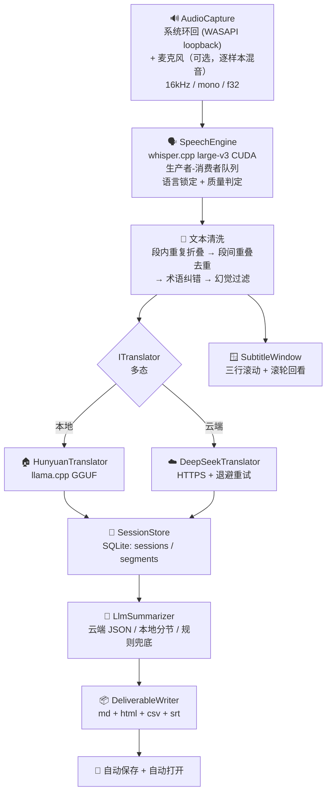

# AudioTranslator · 功能目标 / 架构 / 规划

> **这是本项目的开发基准文档。**
> 动手改代码之前先看第一章；改完如果和本文不一致，回来把本文改一致。
> 最后更新：2026-09-14

---

## 0. 这份文档怎么用

| 文档 | 地位 |
|---|---|
| **本文** | **唯一开发基准**。目标、架构、长期记忆设计、规划的最终口径 |
| `EchoMind_项目优化建议与下一阶段路线.md` | **外部建议稿**（GPT 产出）。是输入，不是结论；采不采纳以本文为准 |
| `README.md` | **已过时**，描述的是早期版本（还说"按提示选择后端"）。以本文为准，不要拿它当依据 |
| `competition/问卷-使用说明.md` | 市场调研问卷的操作说明，与开发无关 |

**四条使用规则**

1. 加任何功能前，先在第一章确认它服务哪一条目标。**服务不了的就先不做**——本项目最大的风险不是功能少，是方向散。
2. 每个模块的设计决定都在 §3.5 里有"为什么"。改之前先读那一条，很多坑已经踩过了。
3. **碰"知识 / 术语 / 长期记忆"之前，先读第六章。** 那里的 §6.5 有一条红线（模型猜的东西不能自动变成约束），破了会静默污染整条链路。
4. **动手前先读第八章**（开发流程）——尤其 §8.0。修好的 bug 要把"出问题怎么判断"写进代码注释（§8.7）。

**先读哪一章**

| 你要做的事 | 先读 |
|---|---|
| 第一次接触这个项目 | 一 → 二 → 三 |
| 想知道现在能不能跑、怎么验证 | 四 |
| 改任何代码 | 三 §3.5 + **八** |
| 碰知识 / 术语 / 记忆 | **六** |
| 决定接下来做什么 | 一 §1.6 + 七 |

---

## 一、要做什么（功能目标）

### 1.1 一句话

> **打开就听，结束就给总结；用得越久，越懂你。**

### 1.2 用户只做三个动作

```
打开  →  正常做自己的事  →  结束
```

中间**不要求**用户做任何选择和配置。

### 1.3 产品红线（违反即做错）

| 红线 | 原因 |
|---|---|
| **不做模式选择** | 不允许弹"1 会议 / 2 课程 / 3 视频 / 4 对话"。场景必须自动判断 |
| **不要求手动配置** | 模型路径自动探测，后端自动降级，参数都有合理默认值 |
| **结束必须是一个动作** | 全局热键 `Ctrl+Alt+Q`，任何程序有焦点时都能按。用户在看全屏视频，控制台没焦点 |
| **必须能离线跑** | 拔网线也要能识别、翻译、出纪要（本地 Whisper + 本地混元 + 规则摘要） |

### 1.4 覆盖场景：一套管线，只换输出

会议 / 课程 / 视频 / 对话共用同一条管线，**只有交付物的标题和章节名随场景变**：

| 场景 | 文档标题 | 章节 |
|---|---|---|
| 会议 | 会议纪要 | 议题要点 / 行动项 |
| 课程 | 课堂笔记 | 本讲内容 / 知识点 / 作业与任务 |
| 视频 | 内容笔记 | 主要内容 / 关键信息 |
| 对话 | 对话记录 | 谈到的内容 / 待办 |

> 架构上**不要**裂成四套 Pipeline。场景只改变：输出结构、摘要重点、行动项规则、交付模板。
> 这一点在 §3.5 有专门的"为什么"。

### 1.5 交付物就是成绩

赛道硬指标要求"**结果交付：能交付可被直接验收、使用的成果**"。
每次会话结束自动生成到 `<out>/session-<id>/`：

| 文件 | 对应 |
|---|---|
| `meeting-<id>.md` | 报告 |
| `meeting-<id>.html` | 网页（单文件，结束自动打开） |
| `actions.csv` | 表格 |
| `transcript.srt` | 双语字幕（加分项） |

### 1.6 明确**不做**（当前阶段）

| 不做 | 原因 |
|---|---|
| 说话人分离（Diarization） | 赛道里不是硬指标；在线会议改用"双流分轨"绕开（见 §3.5⑨） |
| **跨会话逐句字幕浏览** | **数量级不成立**：一次会议几百句、一个月上万句，靠滚轮翻等于没有。跨会话要的是"问"和"跳"，不是"翻"（做法见 §6.9 / §6.8 Evidence） |
| 更强的长期记忆检索 | 属于 P2，会挤掉 P0 |
| 个人知识图谱、多轮 Agent Planning | 同上 |

> ⚠️ 别把"自增长知识库"和这里的"个人知识图谱"搞混：**知识库是 P0（第六章），知识图谱是它的加强版，属 P2。**

---

## 二、现在有什么（功能清单 + 验证状态）

**验证状态口径**：✅ 已实测通过 ｜ ⚠️ 代码就绪但未端到端实测 ｜ ❌ 已知不可用

### 2.1 采集与识别

| 功能 | 位置 | 状态 |
|---|---|---|
| 系统音频环回采集（WASAPI loopback） | `audio_capture.cpp` | ✅ |
| 麦克风采集（与环回逐样本混音） | `audio_capture.cpp` + `--mic` | ⚠️ 单路本身可用，双路端到端未实测 |
| Whisper large-v3 CUDA 识别（16kHz/mono/f32） | `SpeechEngine.cpp` | ✅ 391–854ms |
| 语言检测一次后锁定，每 120s 重检 | `SpeechEngine.cpp` | ✅ |
| VAD 分句（RMS + 滑动窗口兜底） | `main.cpp` | ✅ |
| 幻觉过滤（no_speech / 置信度 / 黑名单 / 提示回显 / 跨段重复） | `SpeechEngine.cpp` | ✅ 可测的两项已进自检：提示回显 3/3 + 跨段重复 5/5 |
| 段间重叠去重（可跳过 0–2 个功能词） | `main.cpp` `strip_overlap` | ✅ 自检 6/6 |
| 段内重复折叠 | `main.cpp` `collapse_repeats` | ✅ 自检 3/3 |

### 2.2 翻译

| 功能 | 位置 | 状态 |
|---|---|---|
| 本地混元 HY-MT1.5-1.8B（llama.cpp，Hunyuan 原生模板） | `HunyuanTranslator.cpp` | ✅ 77–320ms（均 ~124ms） |
| 云端 DeepSeek（HTTPS + 指数退避） | `DeepSeekTranslator.cpp` | ⚠️ 握手已通（曾因 CA 失败，已修），无 key 未端到端实测 |
| 双后端多态 + 运行时切换 | `ITranslator.h` | ✅ |
| 术语纠错（与已知专名编辑距离 = 1 且长度差 ≤ 1 则替换，保留标点） | `TermFixer.cpp` | ✅ 自检 7/7 |
| 源语言 == 目标语言时跳过翻译 | `main.cpp` | ✅ |

### 2.3 呈现

| 功能 | 位置 | 状态 |
|---|---|---|
| 半透明置顶悬浮字幕窗（三行滚动） | `SubtitleWindow.cpp` | ✅ 用户目视确认 |
| 全程可拖动、可拉伸、不抢焦点、不进任务栏 | `SubtitleWindow.cpp` | ✅ |
| 全局热键结束（`Ctrl+Alt+Q`） | `SubtitleWindow.cpp` | ✅ |
| 鼠标滚轮回看本会话历史（上限 500 条） | `SubtitleWindow.cpp` | ✅ 6/6 断言通过 |

### 2.4 沉淀与交付

| 功能 | 位置 | 状态 |
|---|---|---|
| SQLite 落库（sessions + segments，毫秒时间戳） | `SessionStore.cpp` | ✅ |
| 规则摘要兜底（完全离线） | `DeliverableWriter.cpp` | ✅ |
| 场景判定（`content_type`） | `LlmSummarizer.cpp` / `DeliverableWriter.cpp` | ⚠️ 大模型版直接给；规则版只靠关键词粗判（`课`/`lesson`/`lecture` → 课程，`会议`/`meeting` → 会议），判不出按"会议"处理，**视频/对话两类规则版判不出来** |
| 本地 / 云端大模型摘要，失败自动降级 | `LlmSummarizer.cpp` | ⚠️ 摘要**必须用 instruct 模型**；混元 1.8B 是翻译模型，会复读原文 |
| 行动项回填段落号（LCS，≥6 字节） | `LlmSummarizer.cpp` | ✅ |
| 四种交付物自动生成 + 自动打开网页 | `DeliverableWriter.cpp` | ✅ |
| CA 证书探测（HTTPS 必需） | `CaBundle.cpp` | ✅ 内置 150 张证书 |
| 自检 24 例（不需要模型） | `main.cpp --selftest` | ✅ 24/24 |

### 2.5 实测性能（RTX 4060 Laptop / 8187 MiB）

| 环节 | 耗时 |
|---|---|
| Whisper 识别 | 391–854 ms |
| 本地翻译 | 77–320 ms（均 ~124 ms） |
| 端到端（说完到出中文字幕） | ~0.8 s |
| 识别置信度 | 0.75–0.90 |

显存：Whisper ~3.1 GB + 混元 ~0.7 GB + （可选）Qwen instruct ~1.0 GB ≈ 4.8 GB / 7 GB 可用。

---

## 三、架构

### 3.1 数据流



### 3.2 模块职责

| 模块 | 头文件 / 实现 | 职责 | 不该做的事 |
|---|---|---|---|
| `AudioCapture` | `inc/audio_capture.h` | 采音频，输出 float 缓冲 | 不做 VAD |
| `SpeechEngine` | `inc/SpeechEngine.h` | 音频→文字，质量判定，语言锁定 | 不做翻译 |
| `ITranslator` | `inc/ITranslator.h` | 翻译抽象；记录"最新译文的来源" | 不碰 UI |
| `HunyuanTranslator` / `DeepSeekTranslator` | 同名 `.cpp` | 两种后端实现 | 不做降级决策（由 `main.cpp` 决定） |
| `TermFixer` | `inc/TermFixer.h` | 码点级编辑距离纠错 | 不改非专名 |
| `SessionStore` | `inc/SessionStore.h` | 单例，落库与查询 | 不做渲染 |
| `LlmSummarizer` | `inc/LlmSummarizer.h` | 摘要与行动项抽取 | 不写文件 |
| `DeliverableWriter` | `inc/DeliverableWriter.h` | 纯函数渲染四种交付物 | 不访问数据库（只吃传入数据，便于单测） |
| `SubtitleWindow` | `inc/SubtitleWindow.h` | 悬浮窗 + 全局热键 + 滚轮回看 | 不做业务判断 |
| `AppConfig` | `inc/AppConfig.h` | 参数解析 + 路径探测 | — |
| `main.cpp` | — | 编排：VAD、清洗、配对、降级、交付 | 不藏业务逻辑到别处 |

### 3.3 线程模型

| 线程 | 做什么 | 与谁通信 |
|---|---|---|
| 主线程 | VAD 分句、文本清洗、翻译配对、UI 推送、落库、结束生成纪要 | 轮询 `SpeechEngine` / `ITranslator` 的计数器 |
| miniaudio 回调 | 采集音频写入环形缓冲 | 无锁/短锁 |
| `SpeechEngine` 工作线程 | 取音频 → Whisper → 写结果 + 计数器 | 条件变量 |
| `ITranslator` 工作线程 | 取文本 → 翻译 → 写结果 + 计数器 | 条件变量 |
| `SubtitleWindow` 线程 | 建窗、消息循环、低级鼠标钩子、绘制 | `PostMessage(WM_AT_REPAINT)` |

**约定**：识别与翻译**都是异步计数器**，主线程靠 `get_inference_count()` / `get_translation_count()` 判断"有没有新东西"，**不要比较文本**（两段文字相同时会漏判）。

### 3.4 数据模型

```sql
sessions(id, started_at, ended_at, engine, note)
segments(id, session_id, seq, ts, src_text, tgt_text, engine, ms, confidence)
CREATE INDEX idx_segments_session ON segments(session_id, seq);
```

- 时间戳**毫秒精度**（`YYYY-MM-DD HH:MM:SS.mmm`）
- `confidence` 是识别置信度，一路带到库里
- ⚠️ **FTS5 源码在 `external/sqlite3` 里，但 `SQLITE_ENABLE_FTS5` 没有定义** → 现在用不了全文检索。做 `--ask` 之前必须在 `CMakeLists.txt` 加这一行

### 3.5 关键设计决定（**改代码前必读**）

#### ① 语言只检测一次然后锁定，每 120s 重检
逐块检测时置信度只有 p≈0.22，会来回跳，同一场会议的中文译文一会儿英文一会儿中文。
**判断**：语言是会话级属性，不是句子级属性。

#### ② 字幕必须三行、且"滚动"而不是"跳变"
```
① 上一句译文（14pt 暗）  ← 新句子出现时它留在原地
② 当前句原文（16pt 灰）
③ 当前句译文（22pt 亮）  ← 主体；没翻好时留空，不显示占位文字
```
**判断**：占位文字（"翻译中…"）随后被译文替换，本身就是一次多余闪烁 → 改由底部状态行承担。

#### ③ 句子**被下一句顶掉时**才进历史，不是自己翻完时
这是踩过的坑：译文一到就 `push_history`，历史里最新一条就是"当前这句"，而顶部行显示的正是"历史里最新一条" → **顶部行和正文变成同一句话，屏幕上看起来就是重复了一遍**。
**判断**：入历史的时机 = 被顶出正文的那一刻。译文迟到时先用 `pending_source` 记住原文，等译文到了再补。
**出问题怎么判断**：窗口标题带 `p=<顶部行字节数> c=<正文字节数>`，`p` 应当等于上一句译文长度。

#### ④ 识别与翻译按"来源"配对，不能拿"最新原文 + 最新译文"拼
两条异步流，翻译总滞后一句。直接拼会出现「英文第 N 句 + 中文第 N-1 句」。
`ITranslator::get_last_source()` 返回该译文的原文，**配对关系由后端保证**，比在 `main.cpp` 里自己记更可靠。
**出问题怎么判断**：译文来源与当前原文不符时必须丢弃，否则就是错配。

#### ⑤ 悬浮窗永远拿不到焦点，所以滚轮必须靠低级鼠标钩子
窗口是 `WS_EX_NOACTIVATE`（不能抢焦点，否则看视频时会打断你），而滚轮消息默认只发给**焦点窗口**。
Windows 10 有"悬停滚动"，但那是系统设置项，用户或播放器可能关掉 → 不能依赖。
**判断**：用 `WH_MOUSE_LL`，并且**只在真正做了事的时候才拦截**：实时模式往上滚（进历史）拦，往下滚（没东西可看）放行——否则鼠标停在字幕上就没法调音量。

#### ⑥ 历史位置用"序号"记，不用下标
用户往回看的时候新句子还在进来。用下标记位置，每来一句整个视图就往上漂一格，**越看越跳**。
**判断**：单调递增序号做锚点，前面被裁掉时再收敛。

#### ⑦ 行高必须由字号推算，不能手写像素再整体缩放
实测 Microsoft YaHei UI 在 144 DPI 下：字号像素 24→31px、30→39px、32→41px、48→62px，即 **行高 ≈ 字号像素 × 1.30**。
手写行高会踩坑：22px 的行放 15pt 字，在 150% 缩放下就是 39px 字高挤进 33px 行，上下各裁 3px，**笔画被削平**。
**判断**：`make_layout(dpi)` 统一算，`on_paint()` 和窗口高度用同一份参数。

#### ⑧ 窗口底部要收敛，不能只按屏幕高度百分比定位
`0.78 × 屏高 + 窗口高` 在小屏 + 高 DPI 上会溢出：768 高的屏在 125% 缩放下，`0.78×768 + 197 = 796 > 768`，状态行被推出屏幕。

#### ⑨ 平台差异绕开：在线会议用"双流分轨"，不用说话人分离
Diarization 成本高且不是赛道硬指标。
在线会议里"对方"走系统环回、"你"走麦克风，**物理上天然分轨**，各自锁定语言即可。
面对面交谈没有这个条件 → 只能用"识别置信度"作为语言状态的证据（whisper.cpp 不暴露语言概率）。

#### ⑩ 摘要必须用 instruct 模型
混元 `HY-MT1.5-1.8B` 是**翻译模型**，让它做摘要会**原样复读转录文本**。
本地摘要必须 `--llm-model` 指定一个 instruct 模型（如 Qwen）；否则回退规则摘要。

#### ⑪ HTTPS 必须显式指定 CA bundle
Windows 上 OpenSSL 不会自动用系统证书库，`SSL server verification failed` 是必然结果。
**判断**：`CaBundle::find_ca_bundle()` + `set_ca_cert_path()`，内置 150 张证书兜底。

#### ⑫ 服务的是"任何场景"，所以场景只影响输出层
不要为四个场景写四套管线。场景识别 → 只决定"文档标题和章节名"（`DeliverableWriter::labels_for`）。

---

## 四、怎么跑、怎么测

### 4.1 构建

```powershell
# ⚠️ 先杀掉残留进程，否则链接会报 LNK1168（exe 被占用）
Get-Process Translator -ErrorAction SilentlyContinue | Stop-Process -Force

cmd /c "call ""C:\Program Files\Microsoft Visual Studio\2022\Community\VC\Auxiliary\Build\vcvars64.bat"" >nul 2>&1 && set VCPKG_ROOT=C:\dev\vcpkg && cmake --build C:\dev\projects\AudioTranslator\build --config RelWithDebInfo --target Translator"
```

产物：`build\RelWithDebInfo\Translator.exe`
依赖目录约定：`../whisper.cpp`、`../llama.cpp`、`../models`

### 4.2 跑

```powershell
cd C:\dev\projects\AudioTranslator\build\RelWithDebInfo
.\Translator.exe                                # 回车即用默认后端(本地混元) → 开始记录；Ctrl+Alt+Q 结束并出纪要
.\Translator.exe --mic                          # 叠加麦克风
.\Translator.exe --target en                    # 翻译成英文
.\Translator.exe --summarizer rules             # 强制离线规则摘要
.\Translator.exe --summarizer cloud --api-key sk-xxx
.\Translator.exe --lang ja --target zh          # 固定源语言，跳过自动检测
```

> ⚠️ 现在启动时会打印一行 `选择翻译后端 [回车 = 本地混元 / 1 = DeepSeek 云端 / 2 = 本地混元 / 0 = 退出]`。
> 回车即用默认值，所以不算"让用户做选择题"，但**它仍然是个交互步骤**——离"打开就听"还差一步。
> 若要彻底去掉，后端选择应改为按 `--summarizer`/`--api-key` 是否存在自动决定（列入 P1）。

### 4.3 验证入口（不需要音频、不需要模型）

| 命令 | 验什么 | 期望 |
|---|---|---|
| `--selftest --db t.db` | 清洗逻辑 + 数据层通路 | 24/24 通过 |
| `--test-window` | 悬浮窗外观、滚动、滚轮回看、拉伸 | 6 句示例 + 40 秒停留 |
| `--demo-session --db t.db` | 往库里写一次假的 12 条会话 | 打印 `已写入演示会话 #1`，**不生成文件** |
| `--export 1 --db t.db --out out_dir` | 由库里的会话重出交付物 | `out_dir\session-1\` 下 4 个文件 |
| `--dump-prompt` | 看发给大模型的 prompt | 打印模板 |
| `--list` | 模型路径探测 | 只打印配置，不启动 |

**实测**（`--demo-session` → `--export 1`）：

```
verify_out\session-1\meeting-1.md     3663 B
verify_out\session-1\meeting-1.html   6636 B
verify_out\session-1\actions.csv       752 B
verify_out\session-1\transcript.srt   1611 B
```

> ⚠️ `--demo-session` 只写库、不出文件。要出文件得再跑 `--export <id>`。
> 正常使用时不用管这两步——按 `Ctrl+Alt+Q` 结束后主流程会自动生成并打开网页。

### 4.4 悬浮窗的自动化验证手法

窗口没标题栏、不进 Alt+Tab，所以**用户看不到标题，但外部工具读得到**。
窗口标题里带着状态：`AT live 6 wheel=3 p=54 c=47` / `AT hist 2/6 shown=6 wheel=9 p=.. c=..`

- `live` / `hist` — 实时 / 回看模式
- 数字 — 历史条数 / 距最新多少句
- `shown=` — 回看时这一屏装下几条（拉大窗口这个数会变大）
- `wheel=` — 收到几个滚轮事件
- `p= c=` — 顶部行 / 正文各画了多少字节（**用来断言顶部行确实是上一句**）

**这是纯交互行为唯一能被自动化断言的办法**，别删。

### 4.5 本机环境的坑

| 现象 | 说明 |
|---|---|
| `FindWindowW` 返回 0 且 `lastErr=5(ACCESS_DENIED)` | 本机（沙箱）限制，**与本程序无关**。测试脚本请用 `EnumWindows` 按类名找窗口 |
| 合成滚轮（`SendInput`）有时送不到目标进程的钩子 | 探针进程自己也装一个 `WH_MOUSE_LL` 钩子即可稳定复现 |
| 屏幕 2560×1600 @150% DPI | 布局常量按 96 DPI 写、用 `MulDiv` 缩放 |

---

## 五、已知限制

| 限制 | 影响 | 处置 |
|---|---|---|
| 麦克风双路端到端未实测 | 会议场景（你 + 对方）未验证 | 下次实测 |
| 云端后端无 API key | 云端翻译/摘要未端到端验证 | 有 key 时补测 |
| 本地摘要需 instruct 模型 | 默认混元会复读 | 用 `--llm-model` 指定，或退回规则摘要 |
| 悬浮窗历史上限 500 条（内存） | 超长会话最早的回看条目被挤掉 | 可接受：跨会话回看不做（§1.6） |
| `SQLITE_ENABLE_FTS5` 未开启 | 无法全文检索 | **做 §6.9 `--ask` 之前必须先加** |
| 术语表是纯文本文件 | 错了只能手改，无法追溯来源、无法区分"已确认/待确认" | 升级成知识库，设计见 §六 |
| 小模型偶发过度翻译 | 例：凭空加了"那些声音" | 可接受 |
| `and more.` 可能仍泄漏 ≤2 次 | 跨段重复抑制窗口 20 已缓解 | 可接受 |
| 教学类内容里 `The car is packed.` 会合法重复两次 | 不是 bug | 不改 |
| `README.md` 过时 | 误导 | 以本文为准 |

---

## 六、长期记忆设计（自增长知识库）

> **状态：设计完成，尚未实现。** 这是"用得越久，越懂你"的**全部**实现路径。
> 写在规划之前，是因为规划里的 P0 基本都是它的组成部分。

### 6.1 三层记忆：前两层已经有了，缺的是第三层

| 层 | 是什么 | 生命周期 | 现状 |
|---|---|---|---|
| **工作记忆** | 当前会话正在发生的：最近若干段转录、当前主题、悬浮窗里的回看历史 | 会话内 | ✅ 已实现（内存 + `SubtitleWindow`） |
| **会话记忆** | 一次完整会话：摘要、主题、决策、行动项、全文转录 | 长期保存、可单独检索 | ✅ 已实现（`sessions` + `segments` + 交付物） |
| **长期记忆** | **跨会话长期有效**：术语、事实、决策、人物、项目 | 跨会话累积 | ❌ **本文档这一章** |

### 6.2 现状为什么不行

术语表现在是 `terms.sample.txt`，一个纯文本文件：

- 错了只能手改，程序不会告诉你错了
- **不知道某个专名是从哪句话里来的**（没有证据链）
- **分不清"用户确认过的"和"模型猜的"** ← 最致命

第三条直接决定：**模型猜错的东西会不会污染识别提示和翻译约束。**

### 6.3 "自增长"不是"往库里塞条目"，是这个闭环

```
听见 → 理解 → 提取 → 记忆 → 发现变化 → 询问 → 更新 → 再次利用
                              ↑____________________________|
```

只做到"记忆"就只是个数据库。**后三步才是自增长。**

### 6.4 三个增长入口

#### ① 自动抽取（不需要用户参与）

每场会话结束，从转录里抽出：专名 / 事实 / 决策 / 变化事件。全部先落为 **Candidate**。

#### ② 复用形成正反馈（这才是"越用越准"）

```
Confirmed 知识 ──→ Whisper initial_prompt（识别时偏向这个词）
              ──→ 翻译约束 / 术语统一
              ──→ 摘要背景（大模型知道 EchoMind 是项目名，不是错别字）
```

下一场识别更准 → 抽取更准 → 知识更准。**这个正反馈环就是产品壁垒。**

现状对照：`load_glossary_terms()` → `terms_to_prompt()` → `engine.set_initial_prompt()` 这条链**已经通了**，只是源是文本文件而不是知识库。换成知识库是替换数据源，不是新建管线。

#### ③ 用户确认（唯一的人力入口，但只在结束时打扰一次）

见 §6.7。

### 6.5 Confirmed / Candidate 两级 —— 设计里最要紧的一条

| | 来源 | 能做什么 | **不能**做什么 |
|---|---|---|---|
| **Confirmed** | 用户确认 / 用户手输 / 明确可信的系统事实 | 影响识别提示、翻译约束、摘要背景、术语统一 | — |
| **Candidate** | 模型推断 / 低置信度 / 新出现未确认 | 展示、作业背景参考、等待确认 | **不能进识别提示和翻译约束** |

> **红线：模型猜的东西永远不能自动变成约束。** 猜不出来只是没帮上忙；猜错了会污染整条链路，而且用户看不出来。

**纠错路径（必须有，否则用户不敢用）**：用户说"这个记错了" → 改写或删除该条 → 同时写入 `knowledge_history`（谁在什么时候改的、原来是什么）。**历史不删，只追加。**

### 6.6 缺口检测：先只用规则，不上模型

模型判断"哪里该问"成本高且不稳定。四条规则信号就够覆盖绝大多数情况：

| 信号 | 判定 | 例子 |
|---|---|---|
| **译法不一致** | 同一专名在库里有两个 Candidate 值 | 前面「艾瑞卡」，后面「埃里卡」 |
| **高频未确认** | Candidate 且 `hits >= 3` | 一场会说了 8 次的「Phoenix」，库里没有 Confirmed 记录 |
| **低置信度专名** | Candidate 且识别置信度 < 0.5 | 置信度 0.4 的人名 |
| **旧值 ≠ 新值** | 与已有 Confirmed 值冲突 | ASR 从 Whisper large-v3 换成了 Qwen ASR |

第四条就是建议稿强调的 **Event / Decision 一等实体**：只记"当前值"会丢掉"它是怎么变的"，而**"变了"恰恰是最该主动告诉用户的事**。

### 6.7 会话结束时的确认交互

**时机**：交付物生成**之后**（不阻塞交付物），在控制台问 2–5 个问题。

**问题必须来自真实缺口**，不是通用寒暄：

```
[知识] 这场听到 3 次「Phoenix」，一直没确认过。它是你们的内部代号吗？
       [回车跳过 / y 确认 / 输入正确的写法]
```

**与"不打扰用户"红线的边界**（这条要写进代码注释）：

| 允许 | 禁止 |
|---|---|
| 只在**会话结束后**问一次 | 会话进行中弹问 |
| 最多 5 个问题 | 问一堆 |
| 回车即跳过，不问第二遍 | 追着问 |
| 不回答不影响交付物 | 阻塞交付物生成 |

### 6.8 数据模型

```sql
-- 知识条目（当前值）
knowledge(
  id, kind,            -- term | fact | decision | person | project
  key,                 -- 归一化键：'erika' / 'asr_engine'
  value,               -- 当前值：'Erika' / 'Qwen ASR'
  status,              -- confirmed | candidate | archived（见 §6.10）
  confidence, hits,    -- 置信度；被听到过多少次（hits 决定"该问什么"的排序）
  first_seen_at, updated_at,
  source_session, source_seq, source_text   -- 证据：哪次会话、哪一段、原话
);
CREATE UNIQUE INDEX idx_knowledge_key ON knowledge(kind, key);

-- 变化历史（Event / Decision 的落地，只追加不修改）
knowledge_history(
  id, knowledge_id, old_value, new_value, changed_at,
  source_session, source_seq, source_text,
  reason               -- user_confirmed | model_extracted | user_edited
);

-- 行动项（跨会话追踪）
actions(
  id, title, owner, due, status,             -- todo | doing | done
  source_session, source_seq, confidence,
  created_at, updated_at
);
```

**Evidence 是不可省的字段**：`source_session / source_seq / source_text` 让每条知识都能回答"你凭什么这么说"。这也是 P1「Evidence」那一项的数据基础。

### 6.9 `--ask` 的形态

P0 至少要能回答：

```
现在的 ASR 是什么？          → 查 kind=fact, key=asr_engine 的当前值 + 历史
上次会议讲了什么？            → 最近一次 session 的摘要
有哪些未完成任务？            → actions where status != 'done'
Erika 是谁？                 → 查 kind=person, key=erika
```

**前置条件**：`knowledge` / `segments` / 摘要的全文检索需要 **FTS5**，而 `CMakeLists.txt` 里 `SQLITE_ENABLE_FTS5` **没有定义**。动手第一件事就是加上它（源码已在 `external/sqlite3`，只差一行编译选项）。

### 6.10 容量与衰减（不做的话库会烂掉）

自增长的反面是**堆积**。Candidate 不能无限攒：

- Candidate 超过 **30 天**没有被再次听到、也没被确认 → 归档（不删，`status = 'archived'`）
- `hits` 只增不减，用于排序"该问什么"
- Confirmed 永不自动过期（它就是用户的决定）

### 6.11 怎么验证它真的有效

| 指标 | 怎么量 | 期望 |
|---|---|---|
| 专名识别准确率 | 同一段音频，开/关知识提示各跑一遍，比对专名 | 开启后**上升** |
| Candidate 转正率 | 被问到的 Candidate 里用户确认的比例 | 越高说明抽取越准（问题问得越准） |
| 每场会话新增 Confirmed 条数 | 直接计数 | 前期高、后期趋近 0（说明已经稳定，不是失败） |
| `--ask` 命中率 | 造 20 个已知答案的问题，看答对几个 | 作为回归基线 |

**出问题怎么判断**：

| 现象 | 先查哪里 |
|---|---|
| 越用越差、专名反而更乱 | Candidate 是否漏进了 `initial_prompt`（§6.5 红线被破） |
| 用户被问烦了 | 问题数是否超 5、是否在会话中弹了、回车能不能跳过 |
| 库里全是垃圾 | 衰减没做（§6.10），Candidate 无限攒 |
| `--ask` 什么都查不到 | FTS5 是否真的启用了；`key` 归一化是否一致 |

---

## 七、规划

> **排序原则**：服务于"结束就给总结 / 越用越懂你"的排前面。
> 只服务于"技术好看"的排后面或不做。
>
> **P0 里的 1–6 项全都是第六章的组成部分**，动手前先读第六章。

### P0 — 必须完成

| # | 事项 | 为什么它服务于目标 | 设计 |
|---|---|---|---|
| 1 | **知识库骨架**：`knowledge` + `knowledge_history`（合并术语 / 事件 / 决策），带来源、时间、置信度、状态 | "越用越懂你"的唯一实现路径。现在术语表是纯文本，错了只能手改，也不知道某个专名从哪句来的 | §6.8 |
| 2 | **Confirmed / Candidate 两级**：只有用户确认过的才能影响识别提示和翻译约束 | 模型猜错直接污染核心链路，比猜不出来更糟 | §6.5 |
| 3 | **`--ask` 检索**：至少支持"上次会议讲了什么""有哪些没做完的事""Erika 是谁" | 跨会话的正确形态是**问**，不是翻（§1.6） | §6.9 |
| 4 | **知识缺口检测**（先用规则）：译法不一致 / 高频未确认专名 / 低置信度专名 / 旧值 ≠ 新值 | 这是"发现变化"，闭环里最有辨识度的一环 | §6.6 |
| 5 | **Action 跨会话追踪**：`Todo / Doing / Done` + `source_session` | 上次会产生的待办这次被重新提及并更新状态，"数字员工"才开始"持续工作" | §6.8 |
| 6 | **结束时的确认交互**：2–5 个问题，把 Candidate 提升为 Confirmed | 自增长的人力入口。不做这一步，库里永远只有模型猜的东西 | §6.7 |

> ⚠️ **动手第一件事**：在 `CMakeLists.txt` 里打开 `SQLITE_ENABLE_FTS5`，否则 3 做不了。

### P1 — 明显提升产品感

| # | 事项 | 说明 |
|---|---|---|
| 7 | **Evidence（证据链）** | 摘要/行动项可追溯到 `Session / Segment / Timestamp / 原文`。**这才是"回看"的正确形态**：从结论跳回证据，而不是给窗口接个更大的缓冲。字段已在 §6.8 预留 |
| 8 | **补全自动场景识别** | 现状：大模型摘要路径会直接给出 `content_type`；**规则兜底路径只靠关键词粗判**（`课`/`lesson`/`lecture`→课程，`会议`/`meeting`→会议），判不出就按"会议"，视频/对话判不出来。要让"打开就用"在任何后端下都成立 |
| 9 | **去掉启动时的后端选择题** | 现在回车即用默认，但仍是交互步骤。改由参数/环境自动决定，才真正是"打开就听" |
| 10 | **Action 看板** | 展示 Todo / Doing / Done |
| 11 | **知识更新时间** | 例："当前 Qwen ASR / 历史 Whisper large-v3"，数据来自 `knowledge_history` |

### P2 — 后续研究，**不阻塞比赛版本**

说话人分离 · 更强的多语言识别 · 多轮 Agent Planning · 自动工具调用 · 个人知识图谱 · 更强的长期记忆检索 · 多模型调度 · GPU 动态资源管理 · 增量式知识抽取 · 更系统的知识冲突解决

> 注意区分：**"自增长知识库"（第六章）是 P0，不是 P2。** 这里说的"个人知识图谱"和"更强的长期记忆检索"是它的加强版，那才是 P2。

### 已在建议稿里被**修正**的意见

| 建议稿的说法 | 本文的口径 |
|---|---|
| 用音频特征做场景分类 | **不采纳**。用文本 + 大模型判断，成本更低、更准，而且已经实现了 |
| 语言状态机（面对面交谈） | **修正**：whisper.cpp 不暴露语言概率，只能用**识别置信度**当证据；在线会议改用双流分轨 |
| 升级为"持续记忆数字员工" | **采纳定位，但不改核心承诺**。"打开就听，结束就给总结"是差异化，不能被功能堆叠冲掉 |
| 知识冲突"更系统的解决" | **修正**：P0 只用四条规则（§6.6）。上模型判断"该问什么"成本高、不稳定，而且规则已经覆盖绝大多数情况 |

---

## 八、开发流程

> 这一章是**操作手册**，不是理念。每一条都是从本项目实际踩过的事里长出来的。
> 判断标准只有一句：**能不能让"改坏了"在 10 秒内被发现。**

### 8.0 先做这一步：补上基线提交

**现状（2026-09-14 核实）**

| | |
|---|---|
| 最后一次提交 | `7717ace 2026-06-01` —— **3.5 个月前** |
| 未提交 | **12 个修改 + 24 个新增**，共 36 个条目 |
| 未提交里包含 | `SessionStore` / `DeliverableWriter` / `LlmSummarizer` / `SubtitleWindow` / `TermFixer` / `CaBundle` / `AppConfig` / `TranslationLogger` **全部新模块** |

**这意味着：这 3.5 个月没有任何可回退的点。** 改坏了只能靠记忆恢复——而"修好了过两周又改回去"正是本项目反复出现的问题（§8.7），根因就在这里：**没有 diff 可看，没有 commit 可退。**

**动作（按顺序）**

1. `.gitignore` 补 `*.db`（`t.db` 是测试库，不该进仓库）
2. 按模块边界**分几次提交**，不要一个巨型提交。建议切法：

| 提交 | 内容 |
|---|---|
| ① `chore:` | `.gitignore` + `certs/` + `external/sqlite3/` + `tools/` + `terms.sample.txt`（基础设施） |
| ② `feat: 配置与证书` | `AppConfig` + `CaBundle` |
| ③ `feat: 会话存储与交付物` | `SessionStore` + `DeliverableWriter` + `TranslationLogger` |
| ④ `feat: 摘要层` | `LlmSummarizer` |
| ⑤ `feat: 术语纠错` | `TermFixer` |
| ⑥ `feat: 悬浮字幕窗` | `SubtitleWindow` |
| ⑦ `refactor:` | 已有模块的 12 处修改（识别质量、双路采集、语言锁定等） |
| ⑧ `docs:` | `PROJECT.md` + `README.md` 横幅 + 建议稿 |

3. 提交信息写**为什么**，不写"改了哪些文件"——参考仓库里已有的 `fd5cbb8 加入了延迟测量并解决了一些bug`（这条就没说清是什么 bug、为什么）

> 分这么细不是为了好看：是为了**以后能 `git bisect`**。一个 36 文件的巨型提交，出问题时只能整体回退。

---

### 8.1 三条总原则

**① 先想怎么测，再写代码。**

本项目没有测试框架，模型加载又慢，所以"怎么验证"的成本必须在动手前算清楚。想不出验证方式 → 说明这个改动**现在不该做**（要么拆小，要么先补观测点）。

**② 一次只改一件可独立验证的事。**

反例就在眼前：同一个改动里既做了「滚轮回看」又改了「入历史时机」，结果顶部行变成当前句的重复（§3.5③）。**如果分两次改，第一次就能发现。**

**③ 结论性行为必须有可断言的观测点，不能只靠肉眼。**

"顶部行是不是上一句"是结论，必须能断言 → 于是有了窗口标题里的 `p= c=`。
"滚轮有没有生效"是结论 → 于是有了 `wheel=`。
只想靠看一眼就下结论，等于把回归风险留给下一次。

---

### 8.2 五级验证阶梯

**按成本从低到高，能用低级别解决就不要升上去。**

| 级别 | 怎么跑 | 耗时 | 能抓住什么 | 何时**必须**跑到这一级 |
|---|---|---|---|---|
| **L0 编译** | 增量构建（见 §4.1） | 秒–分钟 | 类型错误、链接错误 | 每次都跑 |
| **L1 自检** | `--selftest --db t.db` | **秒级** | 纯逻辑：清洗、去重、术语、提示回显、跨段重复、数据层通路 | 碰任何文本处理或数据层 |
| **L2 免模型** | `--test-window` / `--demo-session`+`--export` / `--dump-prompt` / `--list` | 秒–几十秒 | UI 交互、渲染、交付物渲染、prompt 拼装 | 碰 UI 或交付物 |
| **L3 真音频** | 正常启动 + 真实音频 | 分钟级 | 识别、翻译、端到端延迟、配对逻辑 | **碰识别/翻译链路** |
| **L4 目视** | 人看 | — | 观感、可读性、手感 | **碰任何视觉** |

**要点**

- **L1 是最高性价比的一级。** 不需要模型、秒级完成、24 个用例，能覆盖大部分"逻辑改错"。
  新写的纯逻辑（如知识库的归一化、缺口检测规则）**先做成可进 L1 的静态函数**，别绑死在模型链路上。
- **L2 的边界**：`--test-window` 里的时序**必须照抄真实路径**。它自己模拟了一遍"识别→翻译→入历史"，一旦和 `main.cpp` 不一致，就会出现"演示通过但功能是坏的"——这个坑已经踩过（§8.7②）。
- **L3 需要真实音频**。没有音频源时，说"应该没问题"等于没测，必须如实标注为 ⚠️（§二 的验证状态就是这么来的）。
- **L4 不可替代**：DPI 缩放、对比度、字号这些只能人看。但**看了之后要把结论变成 L1/L2 能断言的数字**（例：对比度算出来 2.68:1 → 改成 3.5:1）。

---

### 8.3 一次改动的标准流程

```
0. 前置      Get-Process Translator | Stop-Process    ← 不杀进程链接必失败 LNK1168
1. 判定      这个改动服务第一章哪条目标？服务不了 → 停下，来说明
2. 读设计    §3.5 对应条目 + （碰知识）§6.5 红线
3. 定验证    先写"怎么测"：打算跑到哪一级？需要什么观测点？
4. 实现      小步；不混重构与功能
5. 验证      L0 → L1 → L2 → (L3) → (L4)
6. 记录      注释三件套（§8.6）+ 自检用例 + 文档同步（§8.5）
```

**第 3 步是关键**：如果 L1/L2 都覆盖不到，先补一个观测点再写功能，不要写完再想办法测。

**交付时必须用三段式说明**（这个格式对本项目有效，制度化）：

```
怎么测：      具体的命令 / 操作步骤
理想结果：    期望看到什么，最好带数字
出问题怎么判断：现象 → 先查哪里
```

---

### 8.4 Bug 处理流程

```
1. 现象     先复现，别猜
2. 定位     它是"逻辑错"还是"接线错"？
              逻辑错 → 写一条 L1 用例（能秒级复现）
              接线错 → 加一个可断言的观测点（L2）
3. 修       只修这一件事
4. 固化     把它变成信号 —— 这是这一步的全部意义
5. 记录     注释三件套 + 文档若涉及设计决定则同步
```

**第 4 步不做，这个 bug 一定会回来。** 本项目的几个典型：

| Bug | 固化成了什么信号 |
|---|---|
| 窗口永远停在"翻译中…" | 代码注释里的"⚠️ 轮询必须每轮都执行"+ 原因说明 |
| 字幕与译文错配 | `get_last_source()` 接口 + 配对注释 |
| 顶部行重复当前句 | 标题里的 `p= c=` 断言（6/6）+ 兜底判重 |
| 汉字笔画被削平 | `make_layout()` 统一算行高，不再手写像素 |

---

### 8.5 文档同步规则

**什么时候必须改 `PROJECT.md`**

| 改动类型 | 必须更新 |
|---|---|
| 新增/删除功能 | §二 功能清单（含验证状态） |
| 改了设计决定 | §3.5 对应条目 |
| 碰了知识 / 术语 / 记忆 | §六 |
| 优先级变化 | §七 |
| 发现新的坑或限制 | §五 已知限制 |
| 加了新的验证入口 | §4.3 |

**什么时候不用改**：纯内部重构、命名、注释、性能微调（除非实测数字变了 → 那要改 §2.5）。

**规则**：文档和代码在**同一次改动**里一起落地，不要"回头再补"。`README.md` 就是反面教材——它停在 3.5 个月前，`DeliverableWriter.h` 里还写着早已废弃的 `ChatML`。

---

### 8.6 分层边界

- **不要**为四个场景写四套管线（§3.5⑫）
- **不要**把业务判断塞进 UI（`SubtitleWindow` 不做业务）
- `DeliverableWriter` 保持**纯函数**（只吃传入数据），否则没法单独测
- **不要**让 `Candidate` 知识进入识别提示或翻译约束（§6.5 红线）

### 8.7 注释规范：写"为什么"，不写"是什么"

每条修好的坑，注释里要留三样东西：

```cpp
// 【现象】窗口永远停在"翻译中…"
// 【原因】轮询被放在了带 continue 的分支之后，只跑了一次
// 【判断】如果又出现，先检查这段轮询是不是被挪到了 continue 后面
```

**本项目没有测试框架，注释就是回归记忆。** 这一条不是风格偏好，是刚需——已经有好几个 bug 是"修好了、过两周又改回去"。

### 8.8 反模式清单（都真实发生过）

| 反模式 | 实际后果 | 正确做法 |
|---|---|---|
| ① 一次改两件事 | 滚轮回看 + 入历史时机一起改 → 顶部行重复 | §8.1② 拆开 |
| ② 演示脚本自己编时序 | `--test-window` 的 push 时机与 `main.cpp` 不一致 → 演示对了、真实路径错了 | 演示**照抄**真实时序，注释里注明"严格照抄" |
| ③ 靠肉眼下结论 | "顶部行对不对"肉眼看不准，漏了一整个 bug | 变成可断言的 `p= c=` |
| ④ 改了 UI 却不留观测点 | 滚轮、拉伸这种交互完全无法自动验证 | 标题里带状态（§4.4） |
| ⑤ 只说"修好了" | 下次改回去没人知道原来是什么现象 | 注释三件套 |
| ⑥ 文档和代码分家 | README 停在 3.5 个月前；头文件注释还写着已废弃的 `ChatML`；`CMakeLists` 注释写 C++20 实际 C++17 | §8.5 同步规则 |
| ⑦ 长期不提交 | 3.5 个月无回退点，出问题只能整体回滚 | §8.0 |
| ⑧ 为"技术洁癖"加功能 | 提过"把回看接到数据库做跨会话"——要求里根本没有，而且数量级不成立 | 先过 §8.1 的第 1 步判定 |

### 8.9 什么必须停下来问，什么不用问

**必须问（属于产品判断，不能替用户定）**

- 做什么 / 不做什么（例："跨会话回看要不要做"）
- 交互体验（要不要打扰用户、问几个问题、放在什么时机）
- 优先级取舍（P0 里先做哪个）
- 任何**改变用户可见行为、且 L1/L2 验证不了**的改动
- 任何动 git 历史的操作（提交、rebase、force push）

**不用问（属于实现细节，自己定并说明理由）**

- 数据结构、加锁方式、函数切分
- 命名、文件组织
- 内部重构要不要做
- 注释怎么写

### 8.10 交付前自检

```powershell
# 0. 必须：先杀进程，否则链接失败 LNK1168
Get-Process Translator -ErrorAction SilentlyContinue | Stop-Process -Force

# L1 自检：必须 24/24
.\build\RelWithDebInfo\Translator.exe --selftest --db t.db

# L2 免模型入口
.\build\RelWithDebInfo\Translator.exe --test-window        # 滚轮翻历史 + 拉伸 + 顶部行是上一句

# 若动了交付物
.\Translator.exe --demo-session --db v.db --out v_out
.\Translator.exe --export 1 --db v.db --out v_out          # v_out\session-1\ 下应出现 4 个文件
```

**然后回答三个问题，答不上就是没做完**

1. 跑到哪一级了？没跑到的级别，如实标注 ⚠️
2. "改坏了"能在 10 秒内发现吗？不能的话，观测点补了没有？
3. `PROJECT.md` 同步了吗？

